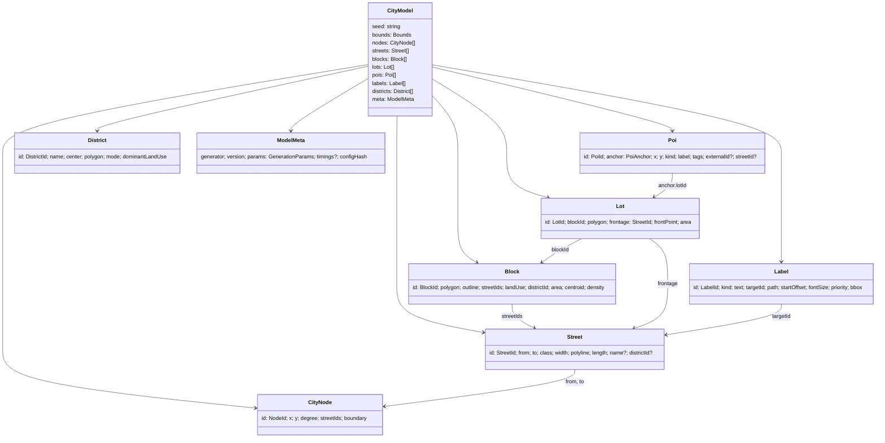
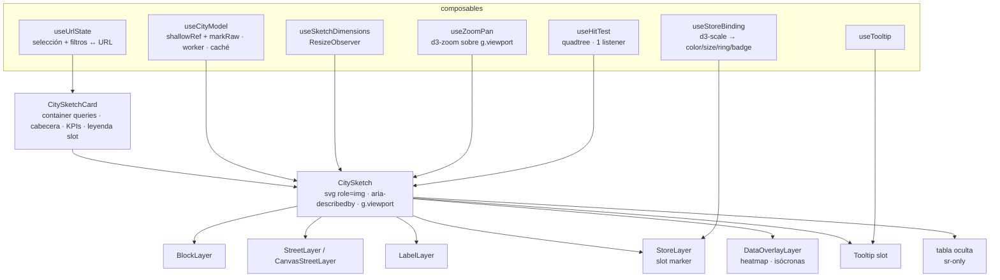

# @empresa/city-sketch — Documento de arquitectura

> Bloque 1 de 6. Motor 100 % sintético de croquis de ciudad: core determinista framework-agnostic + adaptador Vue 3.
> Versión del documento: 0.1.0 · Fecha: 2026-09-02

## 1. Resumen de decisiones

| # | Decisión | Alternativa descartada | Motivo (≤ 2 frases) |
|---|----------|------------------------|---------------------|
| D1 | **Campo tensorial + hyperstreamlines (Chen et al. 2008)** como modo principal; el resto de modos producen el mismo `RawGraph` y comparten limpieza/manzanas/lotes. | L-system como base (Parish & Müller 2001) | El campo tensorial da control continuo (ángulo, centros, ruido) con pocos parámetros y produce grid/radial/orgánico con la misma maquinaria. El L-system se conserva como modo por su valor de "crecimiento" pero es más difícil de parametrizar de forma estable. |
| D2 | **Siembra Jobard–Lefer** (dsep/dtest) para streamlines, RK4 de paso fijo. | Siembra en grilla regular | Jobard–Lefer garantiza separación uniforme y evita calles casi paralelas antes de la limpieza; RK4 de paso fijo es determinista y suficiente para campos suaves. |
| D3 | **Extracción de caras por recorrido "girar a la izquierda"** sobre el grafo planar con aristas ordenadas angularmente (Jiang & Bunke / Eberly), con poda de filamentos previa. | Base de ciclos mínima genérica (Horton) | Para un grafo planar embebido el recorrido angular es O(E) y trivialmente determinista; Horton es O(E²V) y no aporta nada aquí. |
| D4 | **Inset de manzanas por offset de aristas + recorte por intersección** (medio ancho de cada calle circundante). | Straight skeleton completo | El offset por arista con recorte de vértices cóncavos cubre el 99 % de manzanas convexas/casi convexas en < 0,1 ms; el skeleton completo se usa solo en `lots.method='skeleton'`. |
| D5 | **Subdivisión de lotes OBB recursiva (Vanegas et al. 2012)** por defecto; skeleton-based como alternativa. | Solo skeleton | OBB es robusta, rápida y da lotes rectangulares realistas en manzanas americanas; el skeleton da mejores frentes en manzanas irregulares pero cuesta ~5× más. |
| D6 | **PRNG sfc32 sembrado por xmur3(seed)**, un sub-generador por etapa (`rng('lots')`). | mulberry32 único | sfc32 pasa PractRand/BigCrush con estado de 128 bits; mulberry32 salta ~⅓ de los valores de 32 bits. Un generador por etapa hace que cambiar `lots.minArea` no altere calles ni POIs. |
| D7 | **Ids = hash cyrb53 de (semilla, etapa, clave geométrica cuantizada)**. | Índices de arreglo | Un id derivado de coordenadas cuantizadas sobrevive a reordenaciones y a cambios de parámetros aguas abajo, lo que permite `overrides` y POIs manuales por `lotId` persistentes. |
| D8 | **D3 solo por submódulos**, D3 calcula y Vue renderiza. | `d3-selection` para pintar | Evita dos dueños del DOM; `d3-selection` se usa únicamente como adaptador de eventos de `d3-zoom`, nunca para crear nodos. |
| D9 | **Serialización SVG como string en el core**; Vue renderiza el modelo con `v-for` y usa el serializador solo para exportar. | Vue monta el string con `v-html` | Render por template permite slots, eventos delegados y transiciones; el string garantiza el SVG standalone byte a byte. |
| D10 | **Generación en Web Worker** con `postMessage` de arreglos planos (`Float64Array` transferibles) reconstruidos en el hilo principal. | Solo hilo principal | Ciudades > 300 calles superan 16 ms; el worker mantiene la card interactiva. El coste de reconstrucción (~1 ms) es menor que el clon estructurado de objetos anidados. |
| D11 | **Estilo boceto en dos técnicas**: rough.js (geometría) y filtros SVG (`feTurbulence`+`feDisplacementMap`). | Solo una | rough.js multiplica los nodos SVG (×3–×8 por trazo) pero es barato de pintar; el filtro no añade nodos pero se rasteriza en CPU en Firefox y en cada repaint. Se documenta el coste medido en el bloque 6. |
| D12 | **Tokens en tres capas** (primitivo → semántico → componente), colores OKLCH, emitidos como custom properties en `:host`/`.cs-root`. | Dos capas | La capa de componente permite que un preset cambie solo el grosor de avenidas sin tocar la semántica; OKLCH da variantes claras/oscuras por aritmética de L sin desviar el tono. |

## 2. Diagrama de módulos

```mermaid
flowchart TB
  subgraph core["packages/city-sketch/src/core (framework-agnostic, sin DOM)"]
    direction TB
    types[types.ts<br/>contrato de tipos]
    params[params.ts<br/>defaults + PARAM_SPECS + resolveParams]
    rng[rng/<br/>xmur3 · sfc32 · ids cyrb53]
    geom[geom/<br/>vec · polygon · inset · obb · skeleton · simplex-noise]
    field[field/<br/>basis fields · tensor · RK4 · streamlines JL]
    modes[modes/<br/>tensor · grid-jitter · organic-voronoi · radial · lsystem · hybrid]
    graph[graph/<br/>planar-graph · snap · cleanup · faces]
    blocks[blocks/<br/>blocks · landuse · lots]
    pois[pois/<br/>auto · manual]
    names[names/<br/>lists es/en · labels + colisión]
    svg[svg/<br/>serialize · sketch-rough · sketch-filter]
    pipeline[generate.ts<br/>orquestador puro]
  end

  subgraph theme["src/theme"]
    tokens[tokens.ts<br/>3 capas]
    presets[presets/<br/>blueprint · hand-sketch · minimal-mono · retail-warm · dark-ops]
    css[css.ts<br/>tokens → custom properties]
  end

  subgraph worker["src/worker"]
    wclient[client.ts<br/>createCityWorker · caché LRU por hash]
    wimpl[city.worker.ts<br/>generate → arrays planos]
  end

  subgraph vue["src/vue (adaptador)"]
    comps[components/<br/>CitySketchCard · CitySketch · *Layer]
    compos[composables/<br/>useCityModel · useSketchDimensions · useZoomPan · useHitTest · useTooltip · useStoreBinding · useUrlState]
    canvasR[CanvasStreetLayer<br/>fallback > 5000 elementos]
  end

  subgraph template["src/template"]
    schema[schema.json<br/>JSON Schema 2020-12]
    tpl[template.ts<br/>load · save · migrate]
  end

  params --> pipeline
  rng --> pipeline
  geom --> field --> modes --> pipeline
  geom --> graph --> pipeline
  graph --> blocks --> pipeline
  blocks --> pois --> pipeline
  names --> pipeline
  pipeline --> svg
  tokens --> presets --> css
  css --> svg
  pipeline --> wimpl --> wclient
  wclient --> compos --> comps
  pipeline --> compos
  css --> comps
  schema --> tpl --> compos
```

Dependencias externas por módulo: `geom` usa `d3-polygon` (área, centroide, hull) y `d3-delaunay` (Voronoi de distritos y modo orgánico); `pois`/`vue` usan `d3-quadtree` (hit-test y separación mínima); `vue` usa `d3-zoom` + `d3-selection` (solo eventos) y `d3-scale` (binding de métricas); `svg` usa `d3-shape` (`line().curve(curveCatmullRom)` para suavizado opcional) y `roughjs` (técnica `rough`).

## 3. Pipeline de generación

```mermaid
flowchart LR
  I[GenerationInput] --> R[resolveParams]
  R --> D[1 districts<br/>Voronoi Lloyd×2]
  D --> W[1b water<br/>polígonos de agua]
  W --> F[2 field<br/>campo tensorial]
  F --> T[3 trace<br/>streamlines major → minor]
  T --> G[4 graph<br/>intersecciones + planarización]
  G --> C[5 cleanup<br/>snap · merge · poda]
  C --> B[6 blocks<br/>caras + inset]
  B --> L[7 landuse<br/>retail/residential/park/plaza]
  L --> O[8 lots<br/>OBB / skeleton]
  O --> P[9 pois<br/>auto / manual]
  P --> N[10 names]
  N --> K[11 labels<br/>colisión greedy]
  K --> M[(CityModel)]
  M --> S[serializeSvg]
```



Cada etapa es `(ctx: PipelineContext, prev) => next`, pura, sin estado de módulo. El orquestador mide tiempos y los guarda en `meta.timings` (no forman parte del SVG). Los modos no-tensoriales sustituyen las etapas 2–3 y entregan un `RawGraph` a la etapa 4.

### 3.1 Campo tensorial (etapa 2)

Tensor simétrico sin traza en 2D representado por `[a, b]` con `T = R·[[cos2θ, sin2θ],[sin2θ, −cos2θ]]`:

- **grid(θ):** `[cos 2θ, sin 2θ]` con θ = `tensor.dominantAngle`.
- **radial(c):** con `d = p − c`, `[d.y² − d.x², −2·d.x·d.y]` (normalizado). Eigenvector mayor tangencial, menor radial.
- **boundary(polilínea):** tangente del segmento más cercano `θ = atan2(t.y, t.x)` → mismo tensor que grid. Se aplica a los bordes de agua y al borde del lienzo con peso `boundaryWeight`.
- **noise:** rotación del eigenvector por `simplex2(p / noiseScale) · noiseIntensity · 45°`.
- **Combinación:** `T(p) = Σ wᵢ(p)·Tᵢ(p)` con decaimiento `wᵢ = exp(−decay·|p − cᵢ|²)` para radiales y peso constante para grid; se normaliza la magnitud. Mezcla grid/radial por `gridWeight`.
- **Simetría:** `mirror-x` refleja el punto de muestreo y el tensor; `quad` aplica ambas.

Eigenvectores: `major = (cos θ, sin θ)` con `θ = ½·atan2(b, a)`, `minor = (−sin θ, cos θ)`. Se evalúan una vez por muestra, sin cachear en rejilla, porque el coste de RK4 sobre ~10 000 muestras es < 3 ms.

### 3.2 Trazado (etapa 3)

Jobard–Lefer con dos colas (mayor, menor) y una rejilla espacial uniforme de celda `dsep`:

1. Semilla inicial en el centro de mayor densidad de distrito.
2. Integrar RK4 hacia delante y hacia atrás con `stepSize`; detener si sale del lienzo, entra en agua, `|v| < ε`, gira > 180° respecto al origen, supera `maxSteps` o viola `dtest = 0.5·dsep` contra streamlines existentes de la misma familia.
3. Cerrar círculos si los frentes se reencuentran a `< dcirclejoin = 0.75·dsep`.
4. Generar candidatos a `dsep` perpendicular a cada punto de la streamline aceptada, y en sus extremos para la familia opuesta.
5. Repetir hasta agotar candidatos; primero avenidas (`spacingMajor`), luego calles (`spacingMinor`) usando las avenidas como obstáculo con `dtest` mixto.

`density` escala ambos `spacing` por `lerp(1.6, 0.6, density)`. `curvature` sube `gridWeight⁻¹` y `noiseIntensity`. `chaos` añade jitter gaussiano a las semillas y a `dominantAngle` por distrito.

### 3.3 Modos alternativos

| Modo | Método | Parámetros clave que consume |
|------|--------|------------------------------|
| `grid-jitter` | Rejilla ortogonal con espaciado `blockSize` muestreado por fila/columna; nodos con jitter gaussiano `chaos·0.15·spacing`; cada 4–6 líneas se promueve a avenida; se eliminan aleatoriamente segmentos con prob. `chaos·0.2` sin desconectar. | `blockSize`, `chaos`, `hierarchy`, `tensor.dominantAngle` |
| `organic-voronoi` | Puntos Poisson-disk (Bridson) con radio `blockSize.min`, Voronoi (`d3-delaunay`), relajación Lloyd ×`round(2 + chaos·3)`, aristas = calles; las aristas de celdas más grandes → avenidas por betweenness aproximada (BFS desde k centros). | `blockSize`, `chaos`, `curvature` (suavizado Catmull-Rom) |
| `radial` | Anillos concéntricos a radios `r₀·φⁿ` (φ = razón `1 + 0.35·(1−density)`) y radiales cada `Δθ` que crece con el radio para mantener manzanas ~`blockSize`; ruido angular por `chaos`. | `tensor.radialCenters` (uno por distrito si > 1), `blockSize`, `chaos` |
| `lsystem` | Parish–Müller simplificado: cola de prioridad de segmentos; regla global "seguir densidad" (gradiente de un campo de población sintético) + reglas locales (snap a nodo a `< snapTolerance·2`, extender a intersección a `< spacing`, recortar). Ramas a 90°±`chaos·30°`. | `density`, `chaos`, `cleanup.snapTolerance`, `hierarchy` |
| `hybrid` | Cada distrito recibe un modo por ronda determinista `[tensor, grid-jitter, organic-voronoi, radial]` y se genera recortado a su celda; las calles se unen en la frontera por snap. | `districts` + los de cada modo |

Todos devuelven `RawGraph` (nodos por índice, aristas con polilínea). El coste de la planarización (etapa 4) se paga una vez para todos.

### 3.4 Limpieza topológica (etapa 5)

Orden fijo, cada paso idempotente:

1. **Planarización:** intersecciones segmento-segmento por barrido sobre una rejilla de celda `2·snapTolerance`; se parte cada polilínea en los cruces.
2. **Snap de nodos:** unión-find sobre nodos a `< snapTolerance` (rejilla hash, orden por id).
3. **Fusión de intersecciones:** clústeres de nodos a `< mergeRadius` con grado ≥ 3 se colapsan a su centroide.
4. **Aristas casi paralelas:** en cada nodo, si dos aristas salen con ángulo `< parallelAngle`, se elimina la más corta y se re-conecta su extremo al nodo vecino.
5. **Calles cortas:** aristas de longitud `< minStreetLength` se contraen (no se eliminan) para no romper ciclos.
6. **Filamentos:** si `deadEnds=false`, se podan iterativamente nodos de grado 1.
7. **Degradación a callejón:** las `alleyRatio` calles menores de menor longitud pasan a `alley`.

### 3.5 Manzanas y lotes (etapas 6 y 8)

- **Caras:** aristas dirigidas ordenadas por ángulo en cada nodo; para cada arista no visitada se recorre tomando siempre la siguiente arista CCW en el nodo destino; la cara con área con signo negativa (exterior) se descarta. Complejidad O(E).
- **Inset:** para cada arista de la cara se desplaza hacia dentro `width/2 + margen`; los vértices resultantes son intersecciones de aristas adyacentes; si un vértice cóncavo se cruza se elimina (test de auto-intersección local). Manzanas con área < `blockSize.min²·0.25` tras inset se descartan.
- **OBB split:** OBB mínima por rotating calipers sobre la envolvente convexa (`d3-polygon` hull); corte perpendicular al lado largo en `0.5 ± splitJitter`; recursión hasta `area ≤ maxArea`; lotes sin lado sobre el contorno de la manzana (sin frente) se fusionan con el vecino con frente que comparte el lado más largo; si no hay, se descartan.
- **Skeleton:** offset hacia dentro a `frontageDepth` (mismo inset que D4); la franja frontal se divide por perpendiculares al contorno cada `√minArea`; el núcleo interior se subdivide por OBB.

### 3.6 Uso de suelo, POIs, nombres, etiquetas

- `landUse`: puntuación por manzana `s = (1 − d/retailRadius)·(1−noise) + simplex·noise` donde `d` es distancia normalizada al centro de su distrito; `retail` si `s > 0.55`, `plaza` para las `plazaRatio` manzanas más pequeñas con `s` alto, `park` para las `parkRatio` manzanas más grandes fuera del centro, `water` a las manzanas que intersectan polígonos de agua en > 60 %.
- POIs `auto`: muestreo ponderado sin reemplazo sobre lotes con peso `retailBias·[retail] + (1−retailBias)·density`; rechazo si hay un POI a `< minSpacing` (quadtree). `manual`: `lotId` → `frontPoint` del lote; `(nx, ny)` → coordenadas absolutas y `streetId` más cercana.
- Nombres: `prefix + nombre` sin repetición dentro del modelo; avenidas toman de `avenues`, etc. Listas por `locale`, extensibles por config.
- Etiquetas: candidatos = tramo más recto (mínima curvatura acumulada) de cada calle de longitud ≥ `minLabelLength`; prioridad = clase × longitud; inserción greedy con rechazo por solapamiento de cajas (rejilla de ocupación) en orden de prioridad; texto invertido si el path va de derecha a izquierda para no leer boca abajo.

## 4. Contrato de tipos

El contrato completo está en [`packages/city-sketch/src/core/types.ts`](../packages/city-sketch/src/core/types.ts) y es la única fuente de verdad. Resumen de las entidades:



Decisiones del contrato:

- **Tuplas `[x, y]`** en vez de `{x, y}` para geometría: reducen memoria ~40 % y permiten aplanar a `Float64Array` para el worker sin conversión por campo.
- **Ids branded** (`NodeId`, `StreetId`…): errores de tipo al pasar un `LotId` donde va un `BlockId`, coste cero en runtime.
- `Block.outline` además de `Block.polygon`: el heatmap y el hit-test necesitan la manzana sin inset para que no queden huecos entre manzanas.
- `Poi.anchor` discriminada: un POI movido a mano se guarda como `normalized` y sobrevive a la regeneración con otra semilla; uno anclado a `lotId` sigue al lote si la semilla es la misma.
- `ModelMeta.params` es la **config efectiva**, no la parcial: reproducibilidad garantizada aunque cambien los defaults en versiones futuras.

### 4.1 Esquema de ids estables

| Entidad | Fórmula | Ejemplo |
|---------|---------|---------|
| Nodo | `n_` + cyrb53(seed, 'node', round(x·10), round(y·10)) | `n_1f3a9c` |
| Calle | `s_` + cyrb53(seed, 'street', fromId, toId, ordinal entre el mismo par) | `s_8b02e1` |
| Manzana | `b_` + cyrb53(seed, 'block', round(cx), round(cy)) | `b_c41d77` |
| Lote | `l_` + cyrb53(seed, 'lot', blockId, ordinal dentro de la manzana) | `l_0aa9f2` |
| POI | `p_` + cyrb53(seed, 'poi', clave usuario o label) | `p_e77c10` |
| Etiqueta | `t_` + cyrb53(seed, 'label', kind, targetId) | `t_5d1b03` |
| Distrito | `d_` + cyrb53(seed, 'district', ordinal) | `d_31f0aa` |

El hash se trunca a 8 hex; una colisión dentro del mismo modelo añade sufijo `-2`, `-3` en orden determinista.

## 5. Tabla de parámetros

Fuente de verdad: [`packages/city-sketch/src/core/params.ts`](../packages/city-sketch/src/core/params.ts) (`DEFAULT_PARAMS` + `PARAM_SPECS`). Todo valor fuera de rango se recorta y se reporta, nunca lanza.

| Ruta | Tipo | Rango | Default | Invalida | Efecto |
|------|------|-------|---------|----------|--------|
| `seed` | string | — | `city-001` | todo | Semilla maestra |
| `size.w` / `size.h` | int | 200–4000 | 1200 / 900 | todo | viewBox |
| `mode` | enum | tensor · grid-jitter · organic-voronoi · radial · lsystem · hybrid | `tensor` | todo | Algoritmo de calles |
| `density` | num | 0–1 | 0.5 | field | Escala espaciados ×[1.6→0.6] |
| `curvature` | num | 0–1 | 0.3 | field | Peso radial + ruido + suavizado |
| `chaos` | num | 0–1 | 0.25 | field | Jitter, ruido, tolerancias |
| `hierarchy.avenue/street/alley` | num | 4–40 / 2–30 / 1–20 | 14 / 8 / 4 | blocks | Anchos (inset + stroke) |
| `hierarchy.alleyRatio` | num | 0–1 | 0.15 | cleanup | Fracción de calles → callejón |
| `blockSize.min/max` | num | 20–200 / 40–600 | 40 / 160 | field | Objetivo de tamaño de manzana |
| `districts` | int | 1–12 | 4 | todo | Celdas Voronoi |
| `symmetry` | enum | none · mirror-x · mirror-y · quad | `none` | field | Espejo del campo |
| `tensor.spacingMajor` | num | 60–600 | 160 | field | dsep avenidas |
| `tensor.spacingMinor` | num | 20–300 | 60 | field | dsep calles |
| `tensor.dominantAngle` | num | −90–90 | 0 | field | θ del grid (grados) |
| `tensor.radialCenters` | int | 0–6 | 1 | field | Centros radiales |
| `tensor.noiseIntensity` | num | 0–1 | 0.2 | field | Rotación máx. 0–45° |
| `tensor.noiseScale` | num | 50–1000 | 300 | field | Célula del ruido |
| `tensor.boundaryWeight` | num | 0–1 | 0.3 | field | Alineación a agua/borde |
| `tensor.gridWeight` | num | 0–1 | 0.7 | field | Grid vs radial |
| `tensor.stepSize` | num | 1–20 | 4 | field | Paso RK4 |
| `tensor.maxSteps` | int | 50–5000 | 600 | field | Tope por streamline |
| `cleanup.snapTolerance` | num | 0–30 | 6 | cleanup | Fusión de nodos |
| `cleanup.minStreetLength` | num | 0–100 | 18 | cleanup | Contracción de calles cortas |
| `cleanup.parallelAngle` | num | 0–45 | 12 | cleanup | Fusión casi paralelas (grados) |
| `cleanup.mergeRadius` | num | 0–40 | 10 | cleanup | Fusión de intersecciones |
| `cleanup.deadEnds` | bool | — | false | cleanup | Conservar filamentos |
| `lots.method` | enum | obb · skeleton | `obb` | lots | Subdivisión |
| `lots.minArea/maxArea` | num | 50–5000 / 100–20000 | 400 / 1600 | lots | Área de lote |
| `lots.splitJitter` | num | 0–0.45 | 0.15 | lots | Desplazamiento del corte |
| `lots.frontageDepth` | num | 5–100 | 24 | lots | Franja frontal (skeleton) |
| `lots.skipChance` | num | 0–1 | 0.05 | lots | Manzanas sin subdividir |
| `landUse.parkRatio` | num | 0–0.5 | 0.08 | blocks | Área de parques |
| `landUse.waterRatio` | num | 0–0.4 | 0.05 | todo | Área de agua (afecta campo) |
| `landUse.plazaRatio` | num | 0–0.2 | 0.02 | blocks | Área de plazas |
| `landUse.retailRadius` | num | 0–1 | 0.35 | blocks | Radio comercial |
| `landUse.noise` | num | 0–1 | 0.3 | blocks | Ruido en uso de suelo |
| `pois.mode` | enum | auto · manual | `auto` | pois | — |
| `pois.count` | int | 0–500 | 24 | pois | POIs en auto |
| `pois.retailBias` | num | 0–1 | 0.75 | pois | Sesgo a retail |
| `pois.minSpacing` | num | 0–200 | 40 | pois | Separación mínima |
| `pois.items[]` | PoiSpec[] | — | `[]` | pois | Tiendas manuales |
| `naming.enabled` | bool | — | true | labels | — |
| `naming.locale` | enum | es · en | `es` | labels | Listas de nombres |
| `naming.lists` | parcial | — | — | labels | Listas extra |
| `naming.labelDensity` | num | 0–1 | 0.5 | labels | Fracción etiquetada |
| `naming.minLabelLength` | num | 20–400 | 90 | labels | Longitud mínima |
| `naming.fontSize` | num | 4–24 | 9 | labels | Unidades de mundo |
| `overrides.streets/blocks/pois` | map id → ElementStyle | — | `{}` | — | `style`/`className`/`data-*` |

Invariantes cruzadas aplicadas por `resolveParams`: `blockSize.min ≤ max`, `lots.minArea ≤ maxArea`, `park + water + plaza ≤ 0.8`.

La columna **Invalida** define la caché parcial del worker: cambiar un parámetro de `lots` reutiliza campo, grafo y manzanas ya calculados para esa semilla.

## 6. Sistema de temas

```mermaid
flowchart LR
  P[Primitivos<br/>colors.ink-900: oklch(22% 0.02 260)<br/>fonts.mono, strokes.hair…] --> S[Semánticos<br/>ink, surface, accent, water, park, retail…]
  S --> C[Componente<br/>street.avenue.stroke, block.park.fill, poi.ring…]
  C --> V[Custom properties<br/>--cs-street-avenue-stroke …]
  V --> SVG[SVG standalone<br/>&lt;style&gt; embebido]
  V --> VUE[Vue<br/>estilos scoped + slots]
```

- Cinco presets (`blueprint`, `hand-sketch`, `minimal-mono`, `retail-warm`, `dark-ops`) definen las tres capas; un tema de usuario es `DeepPartial<Theme>` sobre un preset.
- Patrones de relleno (`hatch`, `cross-hatch`, `dots`, `grid`) se emiten como `<pattern>` en `<defs>` una sola vez por SVG con id prefijado.
- Estilo boceto: `sketch.technique` ∈ `none | rough | filter`. Con `rough`, el serializador reemplaza cada `<path>` de calle por los paths generados por `rough.generator` (sin DOM, determinista con `seed` derivado del id). Con `filter`, se emite un `<filter id="cs-sketch">` con `feTurbulence baseFrequency=0.02·intensity` + `feDisplacementMap scale=6·intensity` aplicado a la capa de calles. Trade-off: rough ≈ ×4 nodos SVG y +15 ms de generación por 400 calles; filtro ≈ 0 nodos extra pero repaint en CPU en cada zoom (Firefox/Safari), por lo que el adaptador Vue lo desactiva durante el gesto de zoom y lo reactiva al soltar.
- Modo `forced-colors: active`: los custom properties se sustituyen por `CanvasText`/`Canvas`/`Highlight` y los patrones se desactivan.

## 7. Adaptador Vue 3



- **Reactividad:** `useCityModel` devuelve `shallowRef<CityModel | null>`; el modelo se marca con `markRaw`. Los layers reciben `props` de arreglos crudos y usan `v-for` con `:key="id"`. Nunca se envuelve la geometría en `ref()`/`reactive()`.
- **Eventos:** `store:hover`, `store:select`, `block:select`, `viewport:change` con payload `{ id, entity, event }`. Un único listener `pointermove`/`click` en el `<svg>` resuelve el objetivo por quadtree (POIs) y por point-in-polygon sobre candidatos del quadtree de centroides (manzanas).
- **Switch de render:** `elementCount` total ≤ 1000 → SVG; 1000–5000 → SVG + hit-test quadtree (ya activo siempre); > 5000 → `CanvasStreetLayer` pinta calles y manzanas en `<canvas>` bajo el SVG, que conserva POIs, overlays y etiquetas. Umbrales configurables por prop.
- **Zoom:** `d3-zoom` sobre un `<g class="cs-viewport">`; la transformación se escribe como atributo `transform` vía `requestAnimationFrame`; `scaleExtent` [0.5, 8], `translateExtent` = bounds con margen; `reset()` con transición si no hay `prefers-reduced-motion`.
- **URL:** `useUrlState` sincroniza `?sel=<poiId>&f=<tags>&z=<k,x,y>` con `history.replaceState` debounced.
- **Accesibilidad:** `role="img"` + `aria-describedby` a un `<desc>` generado (n calles, n manzanas, n tiendas); tabla `<table class="cs-sr-only">` con POIs y métricas; `tabindex` en marcadores y flechas ← → para recorrer tiendas por orden de calle; `@media (forced-colors: active)` en estilos.

## 8. Rendimiento

| Presupuesto | Objetivo | Estrategia |
|-------------|----------|------------|
| Generación 400 calles / 150 manzanas | < 50 ms | Rejilla espacial para dtest y planarización (O(n) esperado), sin objetos por punto en RK4 (tuplas reutilizadas), extracción de caras O(E). |
| Render inicial card 400×300 | < 16 ms | ≤ 1000 nodos SVG: calles como un `<path>` por clase con `d` concatenado cuando no hay overrides por calle (3 paths en vez de 400); manzanas por uso de suelo igual; POIs individuales. |
| Worker | — | `generate()` en worker; salida aplanada (`Float64Array` de coordenadas + arreglos de offsets + JSON pequeño de metadatos) transferida con `transfer`; caché LRU (16 entradas) por `configHash` en el hilo principal y en el worker. |
| Zoom/pan | 60 fps | Transform sobre un solo `<g>`; con `sketch.technique='filter'` se desactiva el filtro durante el gesto. |

Los números medidos se entregan en el bloque 6 (`bench/*.bench.ts` con Vitest bench en Node y una página de benchmark en el playground para el navegador).

## 9. Estructura de carpetas

```
.
├── package.json                  workspaces
├── docs/ARCHITECTURE.md
├── packages/city-sketch/
│   ├── package.json              exports: ., ./core, ./theme, ./vue, ./worker, ./styles.css
│   ├── vite.config.ts            lib build + vitest
│   ├── schema/city-template.schema.json   (bloque 5)
│   ├── src/
│   │   ├── core/                 (bloque 2)
│   │   ├── theme/                (bloque 3)
│   │   ├── vue/                  (bloque 4)
│   │   ├── worker/               (bloque 4)
│   │   └── template/             (bloque 5)
│   ├── test/                     vitest + snapshots SVG por semilla
│   └── bench/
└── apps/playground/              Vite + Vue, editor visual (bloque 5) y dashboard demo (bloque 4)
```

## 10. Riesgos y trade-offs conocidos

- **Determinismo flotante:** `Math.sin/cos/atan2/exp` no están garantizados bit a bit entre motores JS. En V8/SpiderMonkey/JSC actuales son consistentes para los rangos usados, y el serializador redondea a `precision` decimales (3 por defecto), lo que absorbe diferencias de último ulp. Los snapshots se validan en Node 22 (V8).
- **Streamlines vs. manzanas cerradas:** el trazado puede dejar calles que no cierran ciclo cerca del borde; se resuelve prolongando streamlines hasta el borde del lienzo (nodos `boundary=true`) para que el borde actúe como calle virtual en la extracción de caras.
- **Inset de manzanas no convexas:** el offset por arista puede producir auto-intersecciones en manzanas con entrantes profundos; se detecta y en ese caso se recurre al skeleton simplificado (más lento). Se reporta en `meta.timings` como coste extra.
- **rough.js:** aumenta nodos SVG y tamaño del archivo exportado (×3–×5). Se recomienda solo para exportación o cards con < 300 calles.
- **Filtros SVG:** coste de rasterización por repaint; desactivado durante zoom y en `prefers-reduced-motion` no afecta pero sí en `forced-colors` (se elimina).

## 11. Referencias

- Chen, G., Esch, G., Wonka, P., Müller, P., Zhang, E. *Interactive Procedural Street Modeling*. ACM TOG 27(3), SIGGRAPH 2008. https://dl.acm.org/doi/10.1145/1360612.1360702
- Parish, Y., Müller, P. *Procedural Modeling of Cities*. SIGGRAPH 2001. https://cgl.ethz.ch/Downloads/Publications/Papers/2001/p_Par01.pdf
- Jobard, B., Lefer, W. *Creating Evenly-Spaced Streamlines of Arbitrary Density*. Eurographics Workshop on Visualization 1997. https://link.springer.com/chapter/10.1007/978-3-7091-6876-9_5
- Vanegas, C. et al. *Procedural Generation of Parcels in Urban Modeling*. CGF 31(2), 2012. https://onlinelibrary.wiley.com/doi/abs/10.1111/j.1467-8659.2012.03047.x
- Eberly, D. *Constructing a Cycle Basis for a Planar Graph*. Geometric Tools. https://www.geometrictools.com/Documentation/MinimalCycleBasis.pdf
- Jiang, X., Bunke, H. *An optimal algorithm for extracting the regions of a plane graph*. Pattern Recognition Letters 14, 1993.
- ProbableTrain, *MapGenerator* (implementación de referencia TS del campo tensorial). https://github.com/ProbableTrain/MapGenerator/blob/master/docs/algorithmoverview.md
- bryc, *PRNGs en JavaScript* (sfc32, mulberry32, xoshiro128**, xmur3). https://github.com/bryc/code/blob/master/jshash/PRNGs.md
- Mapbox GL, *Collision Detection* (rejilla de colisión para etiquetas). https://github.com/mapbox/mapbox-gl-native/wiki/Collision-Detection
- Rough.js. https://github.com/rough-stuff/rough
- Vue.js, *Reactivity API: Advanced* (`shallowRef`, `markRaw`). https://vuejs.org/api/reactivity-advanced
