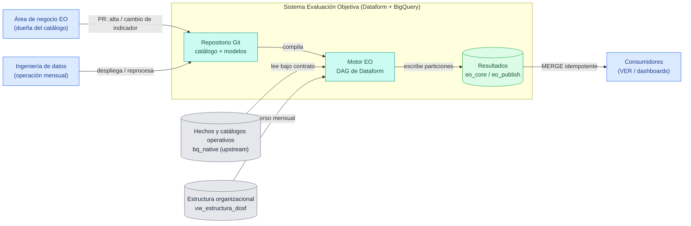
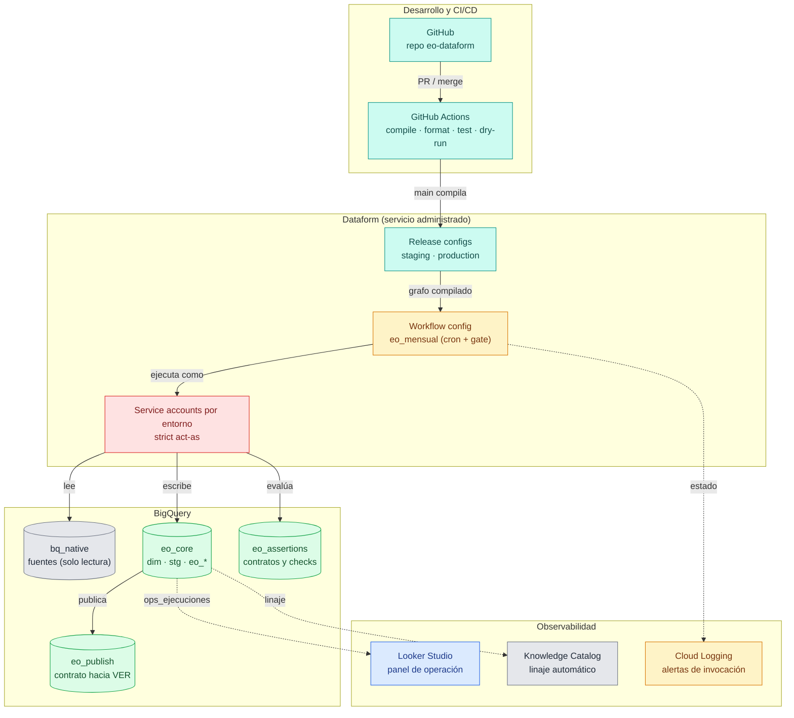
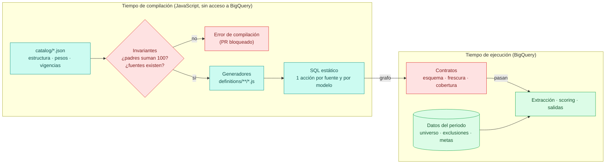
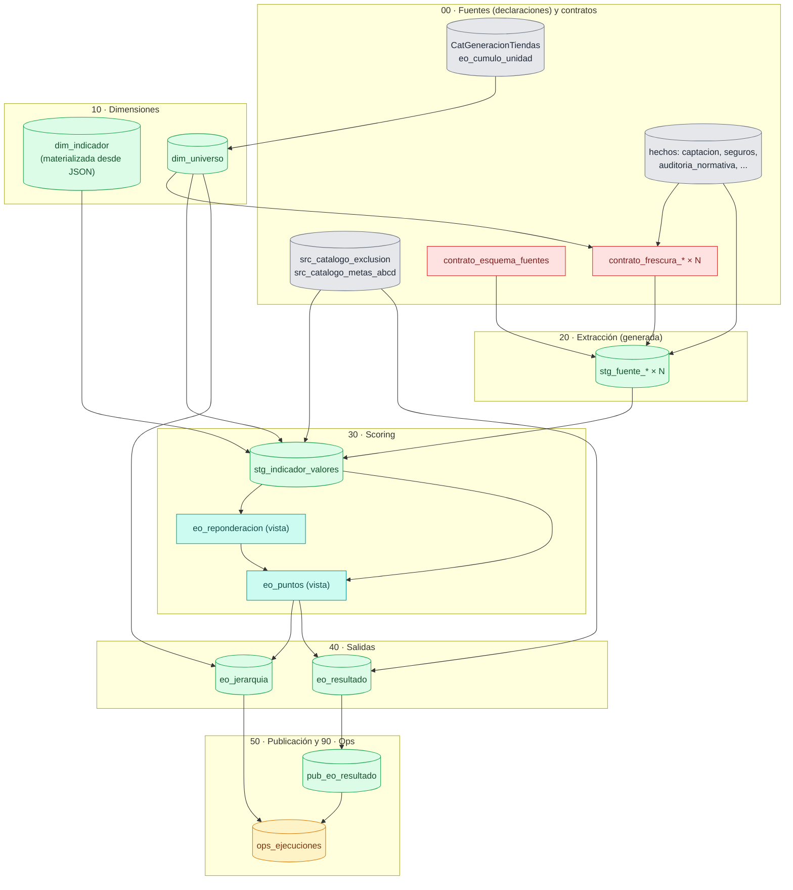
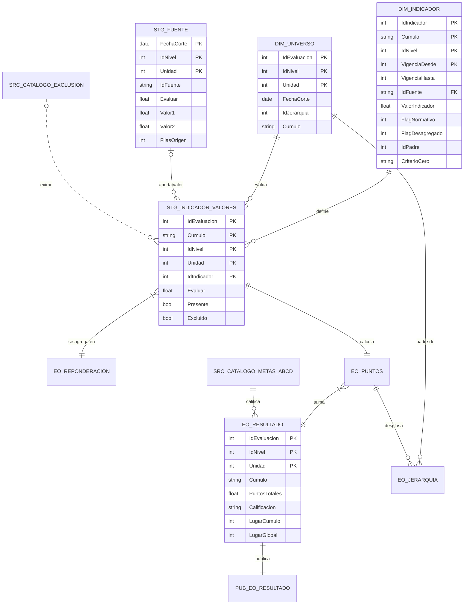
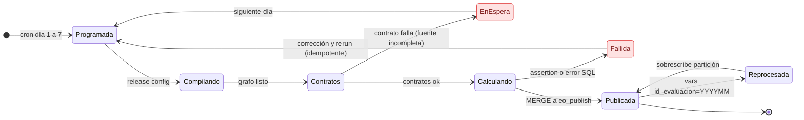
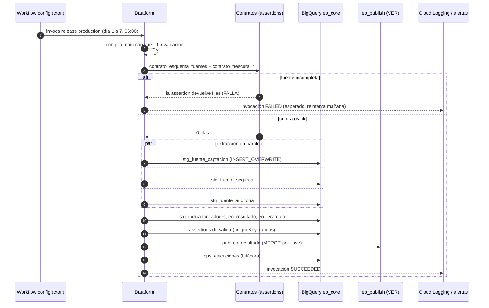
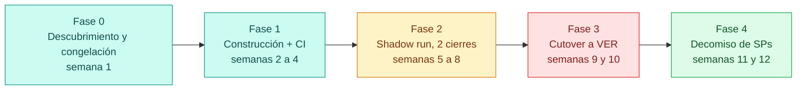

# Evaluación Objetiva on BigQuery Dataform — Target Architecture & Migration Proposal

| | |
|---|---|
| **Status** | Proposal (RFC) — ready for review |
| **Date** | 2026-09-02 |
| **Scope** | `bq_native/evaluacion_objetiva` (BigQuery native SPs) → Dataform-managed workflow |
| **Input** | *Evaluación Objetiva (EO) — Exhaustive Technical & Architectural Reference* |
| **Validation** | Reference implementation in Appendix A compiles with Dataform core **3.0.67** (`dataform compile`, `--vars`, `--schema-suffix` and catalog-invariant failure all verified) |

**Contents**

0. [TL;DR](#0-tldr)
1. [Context, goals and non-goals](#1-context-goals-and-non-goals)
2. [Current-state assessment](#2-current-state-assessment-senior-review)
3. [Design principles](#3-design-principles)
4. [Options considered](#4-options-considered)
5. [Target architecture](#5-target-architecture) — context, containers, layers, compile vs run time, DAG, data model, repo layout
6. [Detailed design](#6-detailed-design) — catalog-as-code, contracts, extraction, scoring, outputs, publish, ops
7. [Period handling, idempotency and backfills](#7-period-handling-idempotency-and-backfills)
8. [Environments, security and IAM](#8-environments-security-and-iam)
9. [Orchestration](#9-orchestration)
10. [Quality strategy and CI/CD](#10-quality-strategy-and-cicd)
11. [Observability and operations](#11-observability-and-operations)
12. [Performance and cost](#12-performance-and-cost)
13. [Migration plan](#13-migration-plan)
14. [Risks and mitigations](#14-risks-and-mitigations)
15. [Assumptions and open decisions](#15-assumptions-and-open-decisions)
- [Appendix A — Reference implementation](#appendix-a--reference-implementation-validated)
- [Appendix B — Legacy object → target mapping](#appendix-b--legacy-object--target-mapping)
- [Appendix C — Glossary](#appendix-c--glossary)
- [Appendix D — Sources consulted](#appendix-d--sources-consulted)

---

## 0. TL;DR

**Decision.** Rebuild the EO engine as a Dataform repository using a **hybrid "catalog-as-code" design**: the *structure* of the evaluation (which indicators exist, where each one is read from, its weights and flags per validity period) lives in versioned JSON in Git and is turned into **static SQL actions at compile time**; the *operational data of each month* (organizational universe, cluster membership, exemptions, ABCD thresholds) stays in BigQuery tables guarded by assertions. The four stored procedures that generate SQL at run time with `EXECUTE IMMEDIATE` loops disappear; their logic becomes a DAG of ~20 declarative, lineage-tracked, individually tested actions.

**What you gain.**

- A real DAG: lineage in the console, parallel extraction, bottom-up hierarchy enforced by dependencies (no more "run Nivel 1, then 2, then 3, then relugar" by hand).
- **Data contracts** that fail *before* computing anything when a source is missing rows for the month, killing the "Data Completeness Trap".
- **Idempotent reprocessing** of any month with one variable (`id_evaluacion=YYYYMM`): outputs are partitioned by period and overwritten atomically; publishing to VER becomes a `MERGE` by key, so the manual `DELETE` across Silver/Gold/Prod goes away.
- **Governed catalog**: every indicator change is a pull request validated at compile time (weights must sum to 100, sources must exist), with history and rollback. Historic months reprocess with the weights that were valid *at that time*.
- Environments (dev/staging/prod), CI (`compile`, `format`, unit tests, `--dry-run`), assertions on every table, run log, alerts.

**What stays exactly the same.** The business math (reponderación, normativos, desagregados, cap for over-performers), the dual zero criterion (`p_criterio_pdw`), cluster isolation (`GENERAL` / `STANDALONE`), deterministic ranking with `Unidad ASC` tie-break, and the metadata-driven philosophy.

**Plan.** Four phases over ~12 weeks with a two-cycle shadow run and an automated reconciliation model against the current `eo_tienda` before cutover (§13).

---

## 1. Context, goals and non-goals

### 1.1 Context

- EO was ported from SQL Server PDW/APS (end of support 2026-03-31) to BigQuery as a set of native stored procedures orchestrated by `sp_corre_eo`. The port fixed real legacy bugs (missing `IdNivel` in joins, non-deterministic ranks, hard-coded STANDALONE store lists) but preserved the **procedural, runtime-dynamic-SQL** execution model of PDW.
- Operation is manual and documented in a runbook: a pre-execution checklist, serial execution per level and cluster, a final global re-rank `UPDATE`, and manual deletions when a month is republished to VER.
- Google enforces **strict act-as mode** for all Dataform repositories in 2026: workflows must run under a custom service account. This proposal designs IAM for that from day one.

### 1.2 Goals (measurable)

| # | Goal | Today | Target |
|---|---|---|---|
| G1 | Zero manual steps in the monthly run | checklist + 4 SP calls × levels × clusters + relugar + VER deletes | one scheduled invocation |
| G2 | Fail *before* compute when a source is incomplete for the month | gate checks table/column existence only | schema **and** freshness/coverage contracts block extraction |
| G3 | Reprocess any month idempotently | manual deletes in 3 layers | `--vars=id_evaluacion=YYYYMM`, partition overwrite + `MERGE` |
| G4 | Catalog changes reviewed, versioned and validated | `UPDATE` scripts in prod | PR + compile-time invariants + CODEOWNERS |
| G5 | Lineage and per-table quality visible | incidents table only | Dataform DAG, assertions dataset, Knowledge Catalog lineage |
| G6 | Same code in dev/staging/prod | single dataset | compilation overrides per environment |

### 1.3 Non-goals

- Changing any business rule of the evaluation. Formulas are ported verbatim and unit-tested (§10).
- Replacing the ingestion of upstream fact tables (`captacion`, `seguros`, audit, …). They remain owned upstream and are consumed through declarations and contracts.
- Redesigning the VER visual layer. We define the publish contract (§6.6); VER internals are a follow-up.

---

## 2. Current-state assessment (senior review)

### 2.1 What is good and must be kept

- **Metadata-driven engine.** The catalog decides what is evaluated. This is the right idea; the proposal keeps it and makes the catalog versioned.
- **Pre-flight gates and incidents table.** Fail-fast on empty catalog/universe/metas and on missing columns. We keep the intent and move it to contracts that run as part of the DAG.
- **Anti-fan-out dedupe**, **deterministic ranking**, **SCD2 cluster dimension**, and the **`IdNivel` join fix** are correct engineering decisions; all are preserved.

### 2.2 Pain points and root causes

| # | Symptom (from the reference doc / runbook) | Root cause | Consequence | Addressed in |
|---|---|---|---|---|
| P1 | 4 SPs build SQL at run time in `FOR … EXECUTE IMMEDIATE` loops | PDW-era procedural model | one BigQuery job per indicator, serial; no lineage; no static validation; opaque failures | §5.4, §6.3 |
| P2 | "Data Completeness Trap": a fresh but empty normative table yields zero penalties silently | gates check *existence*, not *content for the month* | wrong scores shipped; manual cross-checks in checklist | §6.2 |
| P3 | Must run bottom-up serially; concurrent runs lock | multi-statement transactions inside SPs; no dependency graph | slow closes; human error | §5.5, §9 |
| P4 | Catalog hot-patched in prod (`03_vistas_unificadas.sql`, `10_activa_desglose…`, `Revisiones Catalogos.dsql`) | catalog = mutable table, no versioning | drift between months, no audit trail, historic months reprocess with *current* weights | §6.1 |
| P5 | `sp_relugar_global_eo` is a post-hoc `UPDATE` that must be remembered | ranking computed per cluster, global rank bolted on | forgotten runs → duplicate "A1" | §6.5 |
| P6 | Republishing a month needs manual `DELETE` of hash ids in Silver/Gold/Prod | append-only `MERGE` without a stable key | error-prone reprocessing | §6.6, §7 |
| P7 | Schema changes require `ALTER TABLE ADD COLUMN` + editing `INSERT` column lists | tables owned by SPs | brittle evolution | §6.3 (Dataform owns DDL) |
| P8 | Two catalog tables with different types need `SAFE_CAST` union view | schema mismatch between `_SF` and `_SF_StandAlone` | fragile dynamic SQL | §6.1 (one typed schema) |
| P9 | No dev/staging/prod, no CI, no unit tests | none in the SP model | every change is tested in prod | §8, §10 |
| P10 | Dedupe uses `ORDER BY 1` | no tie-break rule | which duplicate wins is arbitrary | §6.3 |
| P11 | Only telemetry is `eo_reponderacion_incidencias` | no run log/alerting | nobody knows a run failed until someone looks | §11 |

### 2.3 Legacy constraints that must survive the migration

From §6 of the reference doc, restated as design requirements:

1. Business logic never goes into the engine; it goes into the catalog → **catalog-as-code** (§6.1).
2. `p_criterio_pdw` dual path is a business requirement → **`CriterioCero` per indicator** with a global default (§6.4).
3. Hierarchy is bottom-up → **DAG dependencies** (§5.5).
4. Output schemas extend, never reorder → Dataform manages DDL; `onSchemaChange` policy (§6.3).
5. Global re-rank must always happen → **computed in the same statement** as the cluster rank (§6.5).
6. Never mask missing partitions with `IFNULL` → **contracts** (§6.2) and explicit `Presente` flag (§6.4).

---

## 3. Design principles

1. **Static DAG, dynamic data.** Anything that changes the *shape* of a SQL statement (which table, which columns, which indicators) is code and is resolved at compile time. Anything that changes *values* (which stores exist this month, who is exempt, thresholds) is data and is read at run time.
2. **Immutable, partitioned, idempotent outputs.** Every persisted table is partitioned by `FechaCorte`; a run replaces exactly one partition. Re-running is always safe.
3. **Contracts at the boundary.** Sources are consumed through declarations with schema, freshness and coverage assertions that *gate* extraction.
4. **One definition of the math.** `includes/eo_sql.js` holds the scoring expressions once; views use them; unit tests pin them.
5. **Fail fast, loudly, before writing.** Compile-time invariants → contracts → assertions. Nothing reaches `eo_publish` if any of them fail.
6. **Environment parity by overrides, not branches.** Same code; project/dataset/vars change per environment.
7. **Observability by default.** Every run leaves a row in `ops_ejecuciones`; every table has assertions; lineage is automatic.
8. **Minimal-ops orchestration.** Dataform-native scheduling with a gate first; Cloud Composer only if cross-system dependencies require it.

---

## 4. Options considered

| Criterion | **A. Lift-and-shift** — wrap `sp_corre_eo` in a Dataform `operations` action | **B. Full generation** — everything (incl. monthly parameters) in JSON | **C. Hybrid (chosen)** — structure & weights in JSON, monthly data in tables |
|---|---|---|---|
| Effort | Low (days) | High | Medium (weeks) |
| Lineage / DAG | None (one opaque node) | Full | Full |
| Testability | None | Full | Full (unit tests + assertions) |
| Governance for business owners | Unchanged (SQL `UPDATE`s) | Every exemption/threshold change is a PR — too heavy for ops teams | Structural changes are PRs; monthly operational data stays in tables with assertions |
| Reprocessing | Unchanged | Idempotent | Idempotent |
| Fixes pain points | P3 (scheduling) only | P1–P11 | P1–P11 |
| Blast radius | Minimal | Large refactor of ops habits | Contained; shadow run de-risks |

**Why not A.** It buys a scheduler and Git, and nothing else: no lineage, no contracts, no tests, the loops stay serial, and reprocessing is still manual. It also freezes the PDW execution model into a new tool.

**Why not B.** The universe, exemptions and ABCD thresholds change every month and are owned by operational teams; forcing them through pull requests is the wrong governance for that data and makes the repository the system of record for something it should not own.

**Why C.** It draws the line where the reference doc already draws it ("the engine is metadata, not code") while separating *structure* (rarely changes, must be reviewed) from *operational parameters* (change monthly, must be validated). It also solves P4 for real: historic months reprocess with the catalog **as it was**, thanks to `vigencias` in the JSON.

---

## 5. Target architecture

### 5.1 System context



### 5.2 Containers



### 5.3 Layers and datasets

| Layer | Dataset (per environment project) | Contents | Written by |
|---|---|---|---|
| Sources | `coppel-bq-native.bq_native` (declarations only) | fact tables, `CatGeneracionTiendas`, `eo_cumulo_unidad`, `src_catalogo_exclusion`, `src_catalogo_metas_abcd` | upstream teams |
| Core | `eo_core` | `dim_*`, `stg_*`, `eo_*`, `ops_*` | Dataform |
| Assertions | `eo_assertions` | one view per contract / assertion (auto-named) | Dataform |
| Publish | `eo_publish` | `pub_*` — the data contract consumed by VER | Dataform |

Naming: `dim_` dimensions, `stg_` per-period staging, `eo_` business outputs, `pub_` published contracts, `contrato_` gating assertions, `ops_` operations telemetry. Object names stay in Spanish to match the existing vocabulary of the team and the legacy tables.

### 5.4 The key shift: compile time vs run time



Today `sp_calcula_reponderacion_eo` and `sp_calcula_eo_stg_indicadores` *discover* the SQL to run by joining the catalog with `INFORMATION_SCHEMA.COLUMNS` at run time. In the target design, JavaScript in `definitions/**/*.js` reads `catalog/*.json` during compilation and emits one static action per source. Dataform therefore knows every table read and written before anything executes, which is what gives us lineage, parallelism, `--dry-run` validation and selective runs by tag.

### 5.5 The DAG

Dependency graph produced by `dataform compile` on the reference implementation (Appendix A). `× N` nodes are generated per entry of `catalog/fuentes.json`.



Mapping to the legacy orchestrator:

| Legacy (`sp_corre_eo` step) | Target action(s) | Notes |
|---|---|---|
| Validate `p_cumulo`, catalog > 0, universe > 0, metas > 0 | compile-time invariants + `dim_universo` / `dim_indicador` assertions + `contrato_*` | validation moves *earlier* (PR) and becomes data-aware (per month) |
| `sp_calcula_reponderacion_eo` (probes per indicator) | `stg_indicador_valores` (explicit `Presente`) + `eo_reponderacion` view | one set-based statement; no probes, no `EXECUTE IMMEDIATE` |
| Incidence gate (`eo_reponderacion_incidencias`) | `contrato_esquema_fuentes` + `contrato_frescura_*` as dependencies | a failing contract stops the DAG before extraction |
| `sp_calcula_eo_stg_indicadores` | `stg_fuente_*` (generated) + `eo_puntos` view | extraction runs in parallel; math is in one place |
| `sp_calcula_eo_tienda` + `sp_relugar_global_eo` | `eo_resultado` | cluster rank and global rank in the same statement |
| `sp_calcula_eo_jerarquia` per level | `eo_jerarquia` (all levels) | bottom-up guaranteed by `dim_universo` parent mapping |
| Push to VER (append-only `MERGE`) | `pub_eo_resultado` (incremental, `uniqueKey`) | reprocess = upsert, no manual deletes |
| — (none) | `ops_ejecuciones` | run log |

### 5.6 Data model



### 5.7 Repository layout

```text
eo-dataform/
├── workflow_settings.yaml          # proyecto/dataset/location por defecto + vars
├── package.json                    # (opcional) paquetes npm de Dataform
├── catalog/                        # ← fuente de verdad versionada (§6.1)
│   ├── fuentes.json                #   cómo se lee cada fuente + contrato de frescura
│   └── indicadores.json            #   indicadores, cúmulos, niveles, pesos por vigencia, flags
├── includes/
│   ├── periodo.js                  #   id_evaluacion / fecha de corte (vars → SQL constante)
│   ├── catalogo.js                 #   carga + valida JSON; helpers para generar SQL
│   └── eo_sql.js                   #   la matemática del EO, definida una sola vez
├── definitions/
│   ├── 00_fuentes/                 #   declaraciones + contratos (esquema, frescura, cobertura)
│   ├── 10_dimensiones/             #   dim_universo, dim_indicador
│   ├── 20_extraccion/              #   stg_fuente_* (generado)
│   ├── 30_scoring/                 #   stg_indicador_valores, eo_reponderacion, eo_puntos
│   ├── 40_salidas/                 #   eo_resultado, eo_jerarquia
│   ├── 50_publicacion/             #   pub_eo_resultado (contrato VER)
│   ├── 90_ops/                     #   ops_ejecuciones
│   └── tests/                      #   unit tests del motor (dataform test)
├── .github/workflows/ci.yaml       # compile · format · test · dry-run en cada PR
└── docs/                           # este documento, runbook v2, ADRs
```

---

## 6. Detailed design

### 6.1 Catalog-as-code

**Files.** Two JSON documents replace `CatalogoIndicadores_SF`, `CatalogoIndicadores_SF_StandAlone` and the `vw_eo_catalogo_indicadores` union view.

`catalog/fuentes.json` — *how to read a source* (one entry per physical table/column mapping):

| Field | Type | Meaning | Legacy equivalent |
|---|---|---|---|
| `id` | string | stable key (`captacion`, `seguros`, …) | — |
| `tabla` | string | BigQuery table in `bq_native` | `TablaOrigen` |
| `campoUnidad`, `campoNivel`, `campoFecha` | string | join/filter columns | implicit (`Unidad`, `IdNivel`, `Fecha`) |
| `campoEvaluar`, `campoValor1`, `campoValor2` | string or `"NULL"` | value columns | `CampoEvaluar`, `Valor1`, `Valor2` |
| `ordenDedupe` | string | deterministic tie-break for duplicates | `ORDER BY 1` (P10) |
| `contrato.minFilas`, `contrato.coberturaMinima` | number | freshness/coverage thresholds | checklist step (P2) |
| `contrato.estricto` *(extension)* | bool | `true` = blocks extraction; `false` = warns only (for informational drill-downs) | `DESAGREGADO_OMITIDO` |

`catalog/indicadores.json` — *what is evaluated*:

| Field | Type | Meaning | Legacy equivalent |
|---|---|---|---|
| `idIndicador`, `nombre` | int, string | identity | `IdIndicador` |
| `fuente` | string | FK to `fuentes.json` | `TablaOrigen` + columns |
| `cumulos` | string[] | clusters where it applies | separate `_StandAlone` catalog |
| `niveles` | int[] | levels where it applies | `IdNivel` rows |
| `flagNormativo`, `flagDesagregado`, `idPadre` | int, int, int/null | semantics | same names |
| `criterioCero` | `"PENALIZA"` / `"REPONDERA"` / null | zero handling; null = global default from `vars` | `p_criterio_pdw` |
| `vigencias[]` | `{desde, hasta, pesos{cumulo: peso}}` | weights valid between two `YYYYMM` periods | `ValorIndicador` (mutable) |

*Extension for per-level weights:* add `pesosPorNivel: {"1": {...}, "2": {...}}` to a `vigencia`; `filasDimIndicador()` in `includes/catalogo.js` resolves `pesosPorNivel[nivel] ?? pesos`.

**Compile-time invariants** (`includes/catalogo.js`, verified to fail the build):

- `idIndicador` unique; every `fuente` exists; every `idPadre` exists; a `flagDesagregado` always has a parent.
- For every cluster and every validity cut-off, the *evaluative parents* (`flagNormativo=0 AND flagDesagregado=0`) sum to exactly 100. This is the business invariant the legacy system only assumed.

**Materialization.** `dim_indicador` is a plain table built from `SELECT * FROM UNNEST([STRUCT(...), ...])` generated from the JSON. Downstream consumers (VER, analysts) keep reading a table; Git keeps the history.

**Governance flow.**

1. The business owner opens a PR editing `catalog/indicadores.json` (GitHub's web editor is enough).
2. CI compiles; an invalid catalog fails with a readable message (`Cúmulo GENERAL vigencia 202401: los padres evaluativos suman 90, no 100`).
3. `CODEOWNERS` requires approval from the EO business owner **and** a data engineer.
4. Merge to `main` → staging release compiles automatically → next scheduled run uses it. Tagging promotes to production (§8).

**How the three classic requests work now.**

| Request | Today | Target |
|---|---|---|
| "Add indicator X" | `INSERT` into two catalog tables + maybe a view | add an entry to `indicadores.json` (and to `fuentes.json` if it is a new table); PR |
| "Change the weight of Sales to 15 from October" | `UPDATE` in prod | close the current `vigencia` (`hasta: 202609`), open a new one (`desde: 202610`); PR — history preserved, September reprocesses with the old weights |
| "Exempt store 123 from indicator 7 this month" | `INSERT` into `src_catalogo_exclusion` | **unchanged** — it is monthly operational data, guarded by an assertion (`Unidad` must exist in `dim_universo`, `IdIndicador` must exist in `dim_indicador`) |

**One-off migration of the current catalog** (Phase 1): a SQL export from `vw_eo_catalogo_indicadores` to JSON via `TO_JSON_STRING(ARRAY_AGG(STRUCT(...)))`, reviewed by hand; the `vigencias[0].desde` is set to the first month the new engine will own.

### 6.2 Sources and data contracts

- **Declarations** (`definitions/00_fuentes/declaraciones.js`) are generated from `fuentes.json` plus the four operational catalogs, so `ref()` resolves them and lineage shows the upstream tables.
- **`contrato_esquema_fuentes`** (one assertion): every column the catalog references must exist in `bq_native.INFORMATION_SCHEMA.COLUMNS`. This replaces the `INFORMATION_SCHEMA` join inside `sp_calcula_reponderacion_eo` and the `RAISE ERROR` in the incidence gate.
- **`contrato_frescura_<fuente>`** (one per source): for the period's cut-off date, the source must have at least `minFilas` rows **and** cover at least `coberturaMinima` of the level-1 universe. Rows returned = failure. This is the direct answer to the Data Completeness Trap: an audit table that is fresh but empty for the month now stops the run instead of producing zero penalties.
- Contracts are **dependencies** of the extraction actions, so Dataform will not execute `stg_fuente_*` unless they pass. Non-strict contracts (informational drill-downs) are tagged `contrato_warn` and run in parallel without blocking, reproducing the `DESAGREGADO_OMITIDO` behaviour without a custom incidents table.
- Optional drift contract (Phase 2): row count within ±30 % of the previous period, implemented as a second assertion per source reading the previous `FechaCorte` partition of `stg_fuente_*`.

### 6.3 Extraction (generated)

One incremental table per source, emitted by `definitions/20_extraccion/stg_fuente.js`:

- Static SQL with `SAFE_CAST` normalization to `INT64/FLOAT64` (removes P8).
- `WHERE DATE(campoFecha) = FechaCorte` and `QUALIFY ROW_NUMBER() OVER (PARTITION BY nivel, unidad ORDER BY ordenDedupe) = 1` keep the anti-fan-out fix but make the winner deterministic (P10). `FilasOrigen` records how many duplicates existed, so duplicates become visible in the ops dashboard instead of silently discarded.
- `type: "incremental"`, `incrementalStrategy: "INSERT_OVERWRITE"`, `partitionBy: "FechaCorte"`, `protected: true`: each run replaces the period's partition only; a `--full-refresh` is refused, so history cannot be wiped by accident.
- `requirePartitionFilter: true` prevents accidental full scans by consumers.
- Because each source is its own action, Dataform executes them **in parallel** (P1, P3). Adding a source is adding a JSON entry, not editing a procedure (P7: Dataform owns the DDL; new columns are added by changing the generator, and `onSchemaChange: "EXTEND"` can be enabled if append-only evolution is preferred).

### 6.4 Scoring engine

`stg_indicador_valores` builds the explicit matrix **universe × catalog in force for the period**, left-joins the extracted values and the exemptions, and computes two flags:

- `Excluido` — the unit is exempt for this indicator (`src_catalogo_exclusion`).
- `Presente` — the indicator counts toward the denominator:
  - `CriterioCero = 'PENALIZA'` (legacy `p_criterio_pdw = TRUE`): `Evaluar IS NOT NULL` — zeros are penalized.
  - `CriterioCero = 'REPONDERA'` (legacy `FALSE`): `NOT (IFNULL(Evaluar,0)=0 AND IFNULL(Valor1,0)=0 AND IFNULL(Valor2,0)=0)` — zeros remove the indicator and its weight is redistributed.

The dual path is preserved verbatim, but it is now a **per-indicator attribute with a global default** (`vars.criterio_cero_default`) instead of a procedure parameter, which lets a normative indicator penalize zeros while a commercial one reweights, in the same run.

`eo_reponderacion` (view) is the legacy `PonderacionEvaluada` / `ReponderacionFaltante`, computed with one `GROUP BY` instead of N dynamic probes.

`eo_puntos` (view) applies the exact legacy formulas, defined once in `includes/eo_sql.js`:

| Case | Legacy | Target (`eo_sql.puntosObtenidos`) |
|---|---|---|
| `ValorIndicadorReponderado` | `(ValorIndicadorInicial / PonderacionEvaluada) * 100.0` | `SAFE_DIVIDE(ValorIndicador, PonderacionEvaluada) * 100.0` for evaluative parents; unchanged weight for normativos/desagregados |
| Normativo | `IF(Resultado IS NULL, 0.0, IF(Resultado < 100, ValorIndicadorInicial, 0.0))` | identical |
| Desagregado | `0.0` | identical |
| Parent, not present | (excluded from denominator) | `0.0` |
| Parent, present | `LEAST(Reponderado, Resultado * Reponderado / 100.0)` | identical |

Why views? Dataform unit tests (`dataform test`) mock the inputs of a **view or table** and compare the output rows; they cannot target incremental tables (verified in Dataform core source). Keeping the math in views makes it unit-testable and free (no storage); the persisted layer is `eo_resultado`.

### 6.5 Outputs

- **`eo_resultado`** sums `PuntosObtenidos` per unit, assigns the letter from `src_catalogo_metas_abcd` (`IdIndicador = 999`), and computes **both** ranks in the same statement: `LugarCumulo` (`PARTITION BY IdEvaluacion, IdNivel, Cumulo`) and `LugarGlobal` (`PARTITION BY IdEvaluacion, IdNivel`), both ordered by `PuntosTotales DESC, Unidad ASC`. `sp_relugar_global_eo` and its `UPDATE` cease to exist (P5); the letter stays cluster-local, exactly as today.
- **`eo_jerarquia`** joins `eo_puntos` of level *n* with `dim_universo` to find the parent unit at level *n+1* via `IdJerarquia`. One action covers every level; the DAG guarantees inputs are complete because all levels are produced by the same upstream partition. If some sources only exist at level 1 and higher levels must be rolled up from stores, add `agregacion: "ROLLUP"` to the source spec and let the generator emit a roll-up CTE (open decision D3).
- Assertions: unique key per unit and level, non-null grade and ranks, `PuntosTotales BETWEEN -100 AND 100`, `PuntosObtenidos <= ValorIndicadorReponderado` for non-normative rows, and `NOT (Presente AND Excluido)`.

### 6.6 Publishing to VER

`pub_eo_resultado` is an incremental table with `uniqueKey: [IdEvaluacion, IdNivel, Unidad]` (Dataform generates a `MERGE`) and `updatePartitionFilter` limited to the period's partition. Reprocessing a month therefore **updates** the existing rows instead of being ignored by an append-only merge (P6). Column descriptions in the config are the published data contract.

If VER identifies rows by a hash id, the same hash is computed deterministically in this model (`IdHash = TO_HEX(SHA256(CONCAT(...)))`) so downstream merges upsert. The recommended follow-up is to move the Silver/Gold/Prod steps of `03_SUBIR_EO_AL_VER.md` into this same repository as `pub_*` models, which removes the last manual deletion.

### 6.7 Operations telemetry

`ops_ejecuciones` (operations action with `hasOutput: true`) appends one row per successful run with the period, timestamp, number of units and clusters evaluated and the number of indicators in force. It depends on `pub_eo_resultado` and `eo_jerarquia`, so a row means "everything published". A second optional table, `ops_fuentes_frescura`, snapshots the contract metrics (rows, coverage) per source per run for trend dashboards.

---

## 7. Period handling, idempotency and backfills

- **One variable drives everything.** `vars.id_evaluacion` (`YYYYMM`). Empty means "previous calendar month" (computed in `includes/periodo.js`); anything else must match `^\d{6}$` or compilation fails. `periodo.fechaCorte()` renders `LAST_DAY(PARSE_DATE('%Y%m', '<id>'))` as a SQL constant, so BigQuery prunes partitions.
- **Every persisted table is partitioned by `FechaCorte`** and uses `INSERT_OVERWRITE`: the run rewrites exactly one partition. Views carry the period through `WHERE FechaCorte = …` in their consumers.
- **`protected: true`** on every incremental table: a `--full-refresh` is rejected, so no run can drop history. Rebuilding history is done by looping periods, never by truncating.
- **Backfill.** Same code, different variable:

```bash
# Ad-hoc (operator with impersonation of the environment service account)
dataform run --vars=id_evaluacion=202603 --default-database=coppel-eo-prod --tags eo --include-deps

# Batch (CI job or Composer loop)
for p in 202601 202602 202603; do
  dataform run --vars=id_evaluacion=$p --default-database=coppel-eo-prod --tags eo --include-deps
done
```

  In the managed service, backfills run through a dedicated **release configuration** (`backfill`) whose compilation override sets `id_evaluacion`, or through the Cloud Composer operator passing `code_compilation_config.vars` (§9).

- **Lifecycle of a period run:**



---

## 8. Environments, security and IAM

### 8.1 Environments

| Environment | Where | Compiles from | Overrides | Who runs |
|---|---|---|---|---|
| **dev** | Dataform workspaces (one per engineer) or local CLI | working branch | `defaultProject: coppel-eo-dev`, `schemaSuffix: _<user>` | manual |
| **staging** | release config `staging` | `main`, on every push | `defaultProject: coppel-eo-stg` | workflow config `eo_mensual_stg` (same cron as prod; shadow) |
| **production** | release config `production` | Git tag `v*` (or `main` once the process is mature) | `defaultProject: coppel-eo-prod` | workflow config `eo_mensual` |

Three projects is the recommended layout because it gives independent IAM, quotas and cost attribution per stage; a single project with dataset suffixes (`eo_core_stg`) is an acceptable fallback and is supported by the same code through `--schema-suffix` (verified).

### 8.2 Service accounts (strict act-as mode)

| Principal | Role(s) | On |
|---|---|---|
| `sa-dataform-eo-<env>@<project>` (custom SA per environment) | `roles/bigquery.jobUser` | env project |
| | `roles/bigquery.dataEditor` | `eo_core`, `eo_assertions`, `eo_publish` datasets |
| | `roles/bigquery.dataViewer` | `coppel-bq-native.bq_native` (sources) |
| Dataform service agent (`service-<n>@gcp-sa-dataform.iam.gserviceaccount.com`) | `roles/iam.serviceAccountUser` | on each custom SA (required by strict act-as) |
| Engineers | `roles/dataform.editor` (dev), `roles/dataform.viewer` (prod) | repository |
| CI (`sa-dataform-eo-ci`) via Workload Identity Federation | `jobUser` + `dataViewer` on staging | staging only; no JSON keys |

The custom SA is set at the repository level (default for all invocations) and can be overridden per workflow configuration. Nothing in the repo contains credentials; the Git connection uses a token stored in Secret Manager.

### 8.3 Governance metadata

- Every action carries `description` and `columns` docs → visible in BigQuery and Knowledge Catalog.
- Labels `sistema=eo`, `capa=<layer>`, `entorno=<env>` on tables and `--job-labels` on jobs for cost attribution.
- Policy tags can be attached in `columns` if any EO field becomes sensitive; `preserveGovernanceControls` keeps them across rebuilds.

---

## 9. Orchestration

### 9.1 Recommended: Dataform workflow configuration with a gate

The monthly run does not need an external orchestrator. A workflow configuration `eo_mensual` on the `production` release runs **daily during the closing window** and relies on the contracts as a gate:

| Setting | Value |
|---|---|
| Schedule | `0 13 1-7 * *` (13:00 UTC = 06:00 America/Mazatlan), days 1–7 of each month |
| Selection | tag `eo`, include dependencies |
| Service account | `sa-dataform-eo-prod` |
| Behaviour | if any `contrato_*` fails, no downstream action runs and the invocation is marked failed; the next day retries automatically. Once contracts pass, the whole DAG runs; later days re-run idempotently and produce identical partitions (or the run can be short-circuited by a `contrato_ya_publicado` assertion that fails when `ops_ejecuciones` already has the period). |

This pattern removes the scheduler dependency on "someone confirming that upstream finished" and turns the checklist into executable checks.



### 9.2 When to use Cloud Composer instead

Use Composer if EO must be chained *after* upstream DAGs that already live there, or if backfills must be driven from a UI. The Airflow Google provider offers `DataformCreateCompilationResultOperator` (with `code_compilation_config` for `vars`), `DataformCreateWorkflowInvocationOperator` (with `invocation_config.included_tags`, `transitive_dependencies_included`, `service_account`) and `DataformWorkflowInvocationStateSensor`. A minimal DAG is: `wait_for_upstream_sensors → compile(vars.id_evaluacion) → invoke(tag eo) → sense(SUCCEEDED) → notify`. The repository does not change.

### 9.3 Lightweight alternative: Cloud Workflows + Cloud Scheduler

For a serverless orchestrator without Composer, a Cloud Workflow calls the Dataform API (`compilationResults.create` → `workflowInvocations.create` → poll) and is triggered by Cloud Scheduler. Useful for parameterized backfills exposed as an HTTP endpoint.

---

## 10. Quality strategy and CI/CD

### 10.1 Layers of verification

| Layer | When | What | Tool |
|---|---|---|---|
| Compile-time invariants | every PR, every release | catalog integrity (weights = 100, references, parents) | `includes/catalogo.js` + `dataform compile` |
| Formatting | every PR | canonical SQLX/JS formatting | `dataform format --check` |
| Unit tests | every PR | scoring math on mocked inputs (reweighting, cap, normativo, desagregado) | `dataform test` (CLI, against staging project) |
| Dry run | every PR | BigQuery validates every generated statement (catches missing columns before the month closes) | `dataform run --dry-run` |
| Contracts | every run | schema, freshness, coverage of sources | `contrato_*` assertions (blocking) |
| Output assertions | every run | keys, nulls, ranges, business invariants | built-in assertions |
| Reconciliation | shadow phase | new `eo_resultado` vs legacy `eo_tienda` per unit, tolerance 1e-4 points and identical rank/grade | `rec_eo_vs_legacy` model + assertion |

### 10.2 Pipeline

```mermaid
flowchart LR
    dev["Desarrollador<br/>workspace o CLI"]:::cliente
    pr["Pull Request"]:::servicio
    subgraph ci["GitHub Actions (cada PR)"]
        fmt["dataform format --check"]:::servicio
        comp["dataform compile<br/>invariantes del catálogo"]:::servicio
        ut["dataform test<br/>unit tests del motor"]:::servicio
        dry["dataform run --dry-run<br/>contra staging"]:::servicio
    end
    merge["merge a main"]:::servicio
    stg["Release staging<br/>(automática)"]:::async
    prod["Release production<br/>(tag vX.Y.Z)"]:::critico

    dev --> pr --> fmt --> comp --> ut --> dry --> merge --> stg
    stg -->|"shadow ok"| prod

    classDef cliente  fill:#DBEAFE,stroke:#2563EB,stroke-width:1px,color:#1E3A8A;
    classDef servicio fill:#CCFBF1,stroke:#0D9488,stroke-width:1px,color:#134E4A;
    classDef async    fill:#FEF3C7,stroke:#D97706,stroke-width:1px,color:#78350F;
    classDef critico  fill:#FEE2E2,stroke:#DC2626,stroke-width:1px,color:#7F1D1D;
```



`.github/workflows/ci.yaml` (pin action SHAs in the real file):

```yaml
name: eo-dataform-ci
on:
  pull_request:
    branches: [main]
permissions:
  contents: read
  id-token: write            # Workload Identity Federation: sin llaves JSON
jobs:
  validate:
    runs-on: ubuntu-latest
    steps:
      - uses: actions/checkout@v4
      - uses: actions/setup-node@v4
        with: { node-version: "22" }
      - run: npm ci
      - name: Formato canónico
        run: npx dataform format --check
      - name: Compila (invariantes del catálogo, sintaxis, grafo)
        run: npx dataform compile --json > /dev/null
      - uses: google-github-actions/auth@v2
        with:
          workload_identity_provider: ${{ secrets.WIF_PROVIDER }}
          service_account: sa-dataform-eo-ci@coppel-eo-stg.iam.gserviceaccount.com
      - name: Credenciales ADC para el CLI
        run: echo '{"projectId":"coppel-eo-stg","location":"US"}' > .df-credentials.json
      - name: Unit tests del motor
        run: npx dataform test
      - name: Dry run de todo el grafo contra staging
        run: npx dataform run --dry-run --schema-suffix=_ci --vars=id_evaluacion=${{ vars.EO_PERIODO_CI }}
```

Promotion: merge to `main` recompiles the `staging` release automatically; a Git tag `vX.Y.Z` (created by the release workflow) is what the `production` release configuration points to.

### 10.3 Unit test example (from Appendix A)

The test mocks `stg_indicador_valores` with three rows for one store — an over-performing parent (weight 60, result 150 %), an absent parent (weight 40) and a failed normative (−2) — and asserts that `eo_puntos` yields `PonderacionEvaluada = 60`, reweighted weights `100 / 66.67 / −2`, and points `100 / 0 / −2`. It documents the reweighting rule better than any prose and breaks the build if someone touches `includes/eo_sql.js`.

---

## 11. Observability and operations

- **Run log:** `ops_ejecuciones` (period, timestamp, units, clusters, indicators) + Dataform's invocation history.
- **Alerting:** log-based alert on `resource.type="dataform.googleapis.com/Repository"` with `state="FAILED"` for the `production` workflow configuration → Pub/Sub → email / Google Chat. Contract failures during days 1–7 are informational; a failure on day 7 pages.
- **Dashboards (Looker Studio on `eo_core` + `eo_assertions`):** last successful period, contract metrics per source (rows, coverage, duplicates via `FilasOrigen`), assertion failures, units per grade, rank churn vs previous month.
- **Lineage:** automatic in Knowledge Catalog for every Dataform-written table; `lineage` settings in `workflow_settings.yaml` (or `--emit-lineage` in the CLI) emit OpenLineage events per action.
- **Cost:** labels per job; on-demand bytes are bounded because every model reads one partition; if the organization has a BigQuery reservation, set `defaultReservation`.
- **SLOs:** EO published for month *M* by day 3 of *M+1* (target 99 %); zero "silent zero" incidents (any missing source is a contract failure, by construction).

**What disappears from the runbook.**

| Runbook document | Today | Target |
|---|---|---|
| `01_CHECKLIST_ANTES_DE_EJECUTAR.md` | manual cross-checks of source completeness | `contrato_*` assertions (§6.2) |
| `02_EJECUTAR_EO_POR_MES.md` | serial calls per level/cluster, then `sp_relugar_global_eo` | one scheduled invocation; ranks computed once (§6.5, §9) |
| `03_SUBIR_EO_AL_VER.md` | manual `DELETE` of hash ids when republishing | `MERGE` by key in `pub_eo_resultado` (§6.6) |
| `Revisiones Catalogos.dsql` | hot-patching catalogs in prod | PR to `catalog/*.json` (§6.1) |

---

## 12. Performance and cost

- **Bytes scanned.** Each `stg_fuente_*` reads one date of its source (partition-pruned when the source is partitioned by `Fecha`; if a source is not partitioned, request partitioning upstream — it is the single largest cost lever). Scoring and outputs read one `FechaCorte` partition each. The generated matrix is ~(units × indicators in force) rows, i.e. tens of thousands of rows per month — trivial for BigQuery.
- **Parallelism.** Dataform executes independent actions concurrently; with N sources the extraction phase takes the time of the slowest source instead of the sum of all, and there is no scripting transaction to lock.
- **Clustering.** `Cumulo, IdNivel, Unidad` on staging/outputs matches every downstream join and the VER filters.
- **Slots.** Fine on on-demand; if a reservation exists, bind via `defaultReservation` so month-end closes do not compete with ad-hoc analysts.
- **Expected effect.** Compute cost is negligible either way; the material saving is operator time (hours per close today) and the elimination of re-runs caused by ordering mistakes.

---

## 13. Migration plan



| Phase | Weeks | Activities | Exit criteria |
|---|---|---|---|
| **0 · Discovery & freeze** | 1 | Export both catalogs and list every `TablaOrigen`/column; confirm assumptions A1–A8 and decide D1–D7 (§15); read the four SP bodies line by line for undocumented special cases; agree to freeze catalog hot-patches in prod during the shadow window (or mirror each one as a PR). | `catalog/*.json` generated from the live catalogs and compiling; source inventory with owners; decisions recorded as ADRs. |
| **1 · Build** | 2–4 | Scaffold the repository from Appendix A; declarations and contracts for all sources (initial thresholds: `minFilas` = 80 % of the 6-month median row count, `coberturaMinima` = 0.95); generators, scoring views, outputs, publish, ops; ≥ 6 unit tests (reweighting, cap, normativo pass/fail/null, desagregado, excluded, PENALIZA vs REPONDERA); CI; environments and service accounts. | `compile`, `format --check`, `test`, `run --dry-run` green on staging; DAG visible in the console; one manual run of the last closed month in staging. |
| **2 · Shadow run** | 5–8 (two closes) | Staging runs on the production schedule. `rec_eo_vs_legacy` compares the new `eo_resultado` with `eo_tienda` per unit/level/cluster (`PuntosTotales` diff ≤ 1e-4, identical `Calificacion`, `LugarCumulo`, `LugarGlobal`) and `eo_puntos` with `eo_stg_indicadores` per indicator. Expected divergences and their fix: dedupe winner (`ordenDedupe`), rank ties (same rule → identical), catalog drift (mirror PR). | Two consecutive closes with 100 % match, or differences documented and signed off by the business owner. |
| **3 · Cutover** | 9–10 | Tag `v1.0.0` → `production` release; enable `eo_mensual`; VER reads `eo_publish.pub_eo_resultado` (or the existing Silver step points to it); SP execution frozen but kept for one cycle as rollback; runbook v2 and alerts live. Rollback = re-run the SP path (separate datasets, nothing destroyed). | First production close published from Dataform by day 3 of the month; zero manual steps executed. |
| **4 · Decommission** | 11–12 | BigQuery table snapshots of `eo_tienda`, `eo_stg_indicadores`, `eo_reponderacion_tienda` and both catalogs; drop SPs and legacy tables; remove manual deletes from the VER procedure; migrate Silver/Gold into `pub_*` models (follow-up); retrospective. | Legacy objects archived; runbook v1 retired. |

---

## 14. Risks and mitigations

| Risk | Likelihood | Impact | Mitigation |
|---|---|---|---|
| Business users reject the PR workflow for the catalog | Medium | Medium | GitHub web editor + PR template with examples; only *structural* changes go through PRs (exemptions and thresholds stay in tables); optional Google Sheet → JSON sync job in Phase 4 if still needed (D1). |
| Undocumented special cases inside the SP bodies | Medium | High | Line-by-line reading in Phase 0; per-indicator reconciliation in Phase 2; nothing is decommissioned before two matching closes. |
| Catalog hot-patched in prod during the shadow window | High | Medium | Freeze agreement; `rec_catalogo` assertion comparing `dim_indicador` with `vw_eo_catalogo_indicadores` every run. |
| Fact tables not partitioned by date (cost) | Medium | Medium | Contracts still work; request partitioning upstream; clustering on `IdNivel, Unidad` meanwhile. |
| Level semantics (D3) implemented wrongly | Medium | High | Decide with the business in Phase 0; reconciliation runs per level. |
| Strict act-as misconfiguration blocks scheduled runs | Low | High | IAM table in §8.2 applied via Terraform; verified in dev before staging. |
| Unit tests cannot run from the GCP UI | Certain | Low | They run in CI with the CLI (documented in §10). |
| Dataform core upgrade changes generated SQL | Low | Medium | `dataformCoreVersion` pinned; upgrades are PRs validated by `--dry-run` and the shadow comparison. |
| Compilation limits (5 000 actions per compilation) | Low | Low | N sources × ~3 actions + a dozen models is two orders of magnitude below the limit. |

---

## 15. Assumptions and open decisions

**Assumptions made to write this proposal (confirm in Phase 0).**

| # | Assumption | If false |
|---|---|---|
| A1 | `IdEvaluacion` identifies the monthly period and can be expressed as `YYYYMM`; `FechaCorte` is the last day of that month. | Change `includes/periodo.js` only. |
| A2 | Fact tables carry `IdNivel` and `Unidad` at every hierarchy level and hold one logical row per unit per cut-off date after dedupe. | Use `agregacion: "ROLLUP"` per source (D3). |
| A3 | `src_catalogo_metas_abcd` is keyed by `(IdEvaluacion, IdNivel, IdIndicador = 999)`. | Add `Cumulo` to the join in `eo_resultado` (one line). |
| A4 | `CatGeneracionTiendas` exposes `IdEvaluacion, IdNivel, Unidad, IdJerarquia` (parent at level + 1). | Adjust `dim_universo`. |
| A5 | `eo_cumulo_unidad` has `Unidad, Cumulo, VigenteDesde`. | Adjust `dim_universo`. |
| A6 | `src_catalogo_exclusion` is keyed by `(IdEvaluacion, IdNivel, Unidad, IdIndicador)`. | Adjust the join in `stg_indicador_valores`. |
| A7 | Weights vary by cluster and validity period, not by level. | Use the `pesosPorNivel` extension (§6.1). |
| A8 | Project names `coppel-eo-dev/stg/prod` and `coppel-bq-native` are placeholders. | Replace in `workflow_settings.yaml` and release configs. |

**Open decisions (need your answer).**

| # | Decision | Recommendation |
|---|---|---|
| D1 | Catalog editing UX: PRs only vs. Google Sheet synced to JSON | PRs only; revisit after two cycles. |
| D2 | Environment layout: three projects vs. one project with dataset suffixes | Three projects. |
| D3 | Higher levels: read facts per level (as today) vs. roll-up from level 1 for some sources | Keep per-level reads; add `ROLLUP` only where a source lacks higher levels. |
| D4 | Orchestrator: Dataform-native gate vs. Cloud Composer | Native gate; Composer only if upstream DAGs already live there. |
| D5 | Results below 0 or above 100: keep legacy behaviour (cap only) or add a floor at 0 | Keep legacy; add an assertion that *reports* out-of-range inputs. |
| D6 | VER consumes `pub_eo_resultado` directly vs. keeps Silver/Gold layers | Direct consumption; migrate Silver/Gold as `pub_*` models in Phase 4. |
| D7 | Retention of `stg_*` partitions | 36 months via `partitionExpirationDays`; outputs kept forever. |

---

## Appendix A — Reference implementation (validated)

The files below are the complete prototype used to validate this proposal. They were compiled locally with `@dataform/cli` 3.0.67 (Dataform core 3.0.67) with the following observed results:

```text
$ dataform compile --json
tables 11  operations 1  assertions 17  declarations 7  tests 1   (no compilation errors)

$ dataform compile --json --vars=id_evaluacion=202603 --schema-suffix=_dev
target: eo_core__dev.eo_resultado   period constant: PARSE_DATE('%Y%m', '202603')

$ # catalog with parents summing 90 instead of 100
Catálogo inválido:
 - Cúmulo GENERAL vigencia 202401: los padres evaluativos suman 90, no 100   (compilation fails)
```

The three sources and four indicators are illustrative; replace them with the export of the live catalog in Phase 0. Column names of the source tables (`Cumplimiento`, `Real`, `Meta`, `FechaCarga`, …) are placeholders for the real ones.

### `workflow_settings.yaml`

```yaml
dataformCoreVersion: 3.0.67
defaultProject: coppel-eo-dev
defaultLocation: US
defaultDataset: eo_core
defaultAssertionDataset: eo_assertions
vars:
  id_evaluacion: ""            # vacío = mes anterior (calculado en includes/periodo.js); override: --vars=id_evaluacion=202608
  criterio_cero_default: "REPONDERA"   # REPONDERA | PENALIZA  (equivale a p_criterio_pdw = FALSE | TRUE)
  proyecto_fuentes: "coppel-bq-native"
  dataset_fuentes: "bq_native"
  dataset_publicacion: "eo_publish"
```

### `catalog/fuentes.json`

```json
[
  {
    "id": "captacion",
    "tabla": "captacion",
    "campoUnidad": "Unidad",
    "campoNivel": "IdNivel",
    "campoFecha": "Fecha",
    "campoEvaluar": "Cumplimiento",
    "campoValor1": "Real",
    "campoValor2": "Meta",
    "ordenDedupe": "FechaCarga DESC",
    "contrato": { "minFilas": 500, "coberturaMinima": 0.95 }
  },
  {
    "id": "seguros",
    "tabla": "seguros",
    "campoUnidad": "Unidad",
    "campoNivel": "IdNivel",
    "campoFecha": "Fecha",
    "campoEvaluar": "Cumplimiento",
    "campoValor1": "Real",
    "campoValor2": "Meta",
    "ordenDedupe": "FechaCarga DESC",
    "contrato": { "minFilas": 500, "coberturaMinima": 0.95 }
  },
  {
    "id": "auditoria",
    "tabla": "auditoria_normativa",
    "campoUnidad": "Unidad",
    "campoNivel": "IdNivel",
    "campoFecha": "Fecha",
    "campoEvaluar": "Calificacion",
    "campoValor1": "Hallazgos",
    "campoValor2": "NULL",
    "ordenDedupe": "FechaCarga DESC",
    "contrato": { "minFilas": 100, "coberturaMinima": 0.90 }
  }
]
```

### `catalog/indicadores.json`

```json
[
  {
    "idIndicador": 1, "nombre": "Captacion", "fuente": "captacion",
    "cumulos": ["GENERAL", "STANDALONE"], "niveles": [1, 2, 3, 4, 5],
    "flagNormativo": 0, "flagDesagregado": 0, "idPadre": null, "criterioCero": null,
    "vigencias": [ { "desde": 202401, "hasta": null, "pesos": { "GENERAL": 60, "STANDALONE": 70 } } ]
  },
  {
    "idIndicador": 2, "nombre": "Seguros", "fuente": "seguros",
    "cumulos": ["GENERAL", "STANDALONE"], "niveles": [1, 2, 3, 4, 5],
    "flagNormativo": 0, "flagDesagregado": 0, "idPadre": null, "criterioCero": null,
    "vigencias": [ { "desde": 202401, "hasta": null, "pesos": { "GENERAL": 40, "STANDALONE": 30 } } ]
  },
  {
    "idIndicador": 21, "nombre": "Seguros - Promotoria", "fuente": "seguros",
    "cumulos": ["GENERAL"], "niveles": [1],
    "flagNormativo": 0, "flagDesagregado": 1, "idPadre": 2, "criterioCero": null,
    "vigencias": [ { "desde": 202401, "hasta": null, "pesos": { "GENERAL": 0 } } ]
  },
  {
    "idIndicador": 90, "nombre": "Auditoria normativa", "fuente": "auditoria",
    "cumulos": ["GENERAL", "STANDALONE"], "niveles": [1, 2, 3],
    "flagNormativo": 1, "flagDesagregado": 0, "idPadre": null, "criterioCero": "PENALIZA",
    "vigencias": [ { "desde": 202401, "hasta": null, "pesos": { "GENERAL": -2, "STANDALONE": -2 } } ]
  }
]
```

### `includes/periodo.js`

```javascript
// Periodo evaluado. Prioridad: --vars=id_evaluacion=YYYYMM  >  mes anterior al de compilación.
function idEvaluacion() {
  const v = (dataform.projectConfig.vars.id_evaluacion || "").trim();
  if (/^\d{6}$/.test(v)) return Number(v);
  if (v !== "") throw new Error(`id_evaluacion inválido: '${v}' (esperado YYYYMM)`);
  const d = new Date(); d.setUTCDate(1); d.setUTCMonth(d.getUTCMonth() - 1);
  return Number(`${d.getUTCFullYear()}${String(d.getUTCMonth() + 1).padStart(2, "0")}`);
}
// Expresión SQL constante para la fecha de corte (último día del mes evaluado).
function fechaCorte() { return `LAST_DAY(PARSE_DATE('%Y%m', '${idEvaluacion()}'))`; }
module.exports = { idEvaluacion, fechaCorte };
```

### `includes/catalogo.js`

```javascript
// Catálogo como código: fuente única de verdad de estructura y pesos. Se valida en compilación.
const fuentes = require("../catalog/fuentes.json");
const indicadores = require("../catalog/indicadores.json");

const fuentePorId = Object.fromEntries(fuentes.map(f => [f.id, f]));
const esPadreEvaluativo = i => i.flagNormativo === 0 && i.flagDesagregado === 0;

function validar() {
  const errores = [];
  const ids = indicadores.map(i => i.idIndicador);
  if (new Set(ids).size !== ids.length) errores.push("idIndicador duplicado en indicadores.json");
  for (const i of indicadores) {
    if (!fuentePorId[i.fuente]) errores.push(`Indicador ${i.idIndicador}: fuente '${i.fuente}' no existe en fuentes.json`);
    if (i.flagDesagregado === 1 && i.idPadre == null) errores.push(`Indicador ${i.idIndicador}: desagregado sin idPadre`);
    if (i.idPadre != null && !ids.includes(i.idPadre)) errores.push(`Indicador ${i.idIndicador}: idPadre ${i.idPadre} inexistente`);
  }
  // Invariante de negocio: los padres evaluativos suman exactamente 100 por cúmulo y vigencia.
  const cumulos = [...new Set(indicadores.flatMap(i => i.cumulos))];
  const cortes = [...new Set(indicadores.flatMap(i => i.vigencias.map(v => v.desde)))].sort();
  for (const c of cumulos) for (const corte of cortes) {
    const suma = indicadores.filter(esPadreEvaluativo).filter(i => i.cumulos.includes(c))
      .map(i => (i.vigencias.find(v => corte >= v.desde && (v.hasta == null || corte <= v.hasta)) || {}).pesos)
      .reduce((acc, p) => acc + ((p && p[c]) || 0), 0);
    if (Math.abs(suma - 100) > 1e-9) errores.push(`Cúmulo ${c} vigencia ${corte}: los padres evaluativos suman ${suma}, no 100`);
  }
  if (errores.length) throw new Error("Catálogo inválido:\n - " + errores.join("\n - "));
}
validar();

// Filas planas para dim_indicador: (indicador × cúmulo × nivel × vigencia)
function filasDimIndicador() {
  const filas = [];
  for (const i of indicadores) for (const c of i.cumulos) for (const n of i.niveles) for (const v of i.vigencias) {
    filas.push({
      IdIndicador: i.idIndicador, Nombre: i.nombre, IdFuente: i.fuente, Cumulo: c, IdNivel: n,
      VigenciaDesde: v.desde, VigenciaHasta: v.hasta, ValorIndicador: (v.pesos[c] != null ? v.pesos[c] : 0),
      FlagNormativo: i.flagNormativo, FlagDesagregado: i.flagDesagregado, IdPadre: i.idPadre,
      CriterioCero: i.criterioCero || dataform.projectConfig.vars.criterio_cero_default
    });
  }
  return filas;
}

const sqlLit = v => v == null ? "NULL" : (typeof v === "number" ? String(v) : `'${String(v).replace(/'/g, "\\'")}'`);
function structRows(rows) {
  const cols = Object.keys(rows[0]);
  return rows.map(r => `STRUCT(${cols.map(c => `${sqlLit(r[c])} AS ${c}`).join(", ")})`).join(",\n    ");
}

module.exports = { fuentes, indicadores, fuentePorId, filasDimIndicador, structRows, sqlLit };
```

### `includes/eo_sql.js`

```javascript
// Fragmentos SQL reutilizables: una sola definición de la matemática del EO.
// rep = expresión SQL del peso reponderado.
const puntosObtenidos = (alias = "v", rep = "ValorIndicadorReponderado") => `
  CASE
    WHEN ${alias}.FlagDesagregado = 1 THEN 0.0
    WHEN ${alias}.FlagNormativo = 1 THEN IF(${alias}.Evaluar IS NULL, 0.0, IF(${alias}.Evaluar < 100, ${alias}.ValorIndicador, 0.0))
    WHEN NOT ${alias}.Presente THEN 0.0
    ELSE LEAST(${rep}, ${alias}.Evaluar * ${rep} / 100.0)
  END`;
// cat = alias con CriterioCero; val = alias con Evaluar/Valor1/Valor2; excl = alias de exclusión (LEFT JOIN).
const presente = ({ cat = "b", val = "v", excl = "x" } = {}) => `
  CASE
    WHEN ${excl}.Unidad IS NOT NULL THEN FALSE
    WHEN ${cat}.CriterioCero = 'PENALIZA' THEN ${val}.Evaluar IS NOT NULL
    ELSE NOT (IFNULL(${val}.Evaluar, 0) = 0 AND IFNULL(${val}.Valor1, 0) = 0 AND IFNULL(${val}.Valor2, 0) = 0)
  END`;
module.exports = { puntosObtenidos, presente };
```

### `definitions/00_fuentes/declaraciones.js`

```javascript
const proyecto = dataform.projectConfig.vars.proyecto_fuentes;
const ds = dataform.projectConfig.vars.dataset_fuentes;
for (const f of catalogo.fuentes) {
  declare({ database: proyecto, schema: ds, name: f.tabla, description: `Fuente EO '${f.id}'` });
}
for (const t of ["CatGeneracionTiendas", "src_catalogo_exclusion", "src_catalogo_metas_abcd", "eo_cumulo_unidad"]) {
  declare({ database: proyecto, schema: ds, name: t });
}
```

### `definitions/00_fuentes/contratos.js`

```javascript
// Contrato de esquema: todas las columnas que el catálogo espera existen en las fuentes (falla antes de calcular).
const proyecto = dataform.projectConfig.vars.proyecto_fuentes;
const ds = dataform.projectConfig.vars.dataset_fuentes;
const esperadas = catalogo.fuentes.flatMap(f =>
  [f.campoUnidad, f.campoNivel, f.campoFecha, f.campoEvaluar, f.campoValor1, f.campoValor2]
    .filter(c => c && c.toUpperCase() !== "NULL")
    .map(c => `STRUCT('${f.tabla}' AS tabla, '${c}' AS columna)`));
assert("contrato_esquema_fuentes", { tags: ["eo", "fuentes", "contrato"], description: "Columnas esperadas por el catálogo presentes en BigQuery" })
  .query(ctx => `
  WITH esperado AS (SELECT * FROM UNNEST([${esperadas.join(", ")}]))
  SELECT e.tabla, e.columna
  FROM esperado e
  LEFT JOIN \`${proyecto}.${ds}.INFORMATION_SCHEMA.COLUMNS\` c
    ON c.table_name = e.tabla AND c.column_name = e.columna
  WHERE c.column_name IS NULL`);

// Contrato de frescura y cobertura por fuente (resuelve la "Data Completeness Trap").
for (const f of catalogo.fuentes) {
  assert(`contrato_frescura_${f.id}`, { tags: ["eo", "fuentes", "contrato"], description: `Fuente '${f.id}' tiene datos del periodo con cobertura mínima` })
    .query(ctx => `
    WITH m AS (
      SELECT COUNT(*) AS filas, COUNT(DISTINCT ${f.campoUnidad}) AS unidades
      FROM ${ctx.ref(f.tabla)}
      WHERE DATE(${f.campoFecha}) = ${periodo.fechaCorte()} AND ${f.campoNivel} = 1
    ), u AS (
      SELECT COUNT(*) AS universo FROM ${ctx.ref("dim_universo")}
      WHERE IdEvaluacion = ${periodo.idEvaluacion()} AND IdNivel = 1
    )
    SELECT '${f.id}' AS fuente, filas, unidades, universo,
           SAFE_DIVIDE(unidades, universo) AS cobertura
    FROM m CROSS JOIN u
    WHERE filas < ${f.contrato.minFilas}
       OR SAFE_DIVIDE(unidades, universo) < ${f.contrato.coberturaMinima}`);
}
```

### `definitions/10_dimensiones/dim_indicador.js`

```javascript
publish("dim_indicador", {
  type: "table", tags: ["eo", "dimensiones"],
  description: "Catálogo de indicadores materializado desde catalog/indicadores.json (versionado en Git).",
  assertions: { uniqueKey: ["IdIndicador", "Cumulo", "IdNivel", "VigenciaDesde"], nonNull: ["ValorIndicador", "CriterioCero"] }
}).query(ctx => `
  SELECT * FROM UNNEST([
    ${catalogo.structRows(catalogo.filasDimIndicador())}
  ])`);
```

### `definitions/10_dimensiones/dim_universo.sqlx`

```sql
config {
  type: "incremental",
  incrementalStrategy: "INSERT_OVERWRITE",
  protected: true,
  bigquery: { partitionBy: "FechaCorte", clusterBy: ["Cumulo", "IdNivel", "Unidad"] },
  tags: ["eo", "dimensiones"],
  description: "Universo organizacional del periodo con su cúmulo vigente (SCD2 resuelto).",
  assertions: { uniqueKey: ["IdEvaluacion", "IdNivel", "Unidad"], nonNull: ["Cumulo"] }
}

WITH cumulo_vigente AS (
  SELECT Unidad, Cumulo
  FROM ${ref("eo_cumulo_unidad")}
  WHERE VigenteDesde <= ${periodo.fechaCorte()}
  QUALIFY ROW_NUMBER() OVER (PARTITION BY Unidad ORDER BY VigenteDesde DESC) = 1
)
SELECT
  g.IdEvaluacion,
  ${periodo.fechaCorte()} AS FechaCorte,
  g.IdNivel,
  g.Unidad,
  g.IdJerarquia,
  IFNULL(c.Cumulo, 'GENERAL') AS Cumulo
FROM ${ref("CatGeneracionTiendas")} g
LEFT JOIN cumulo_vigente c USING (Unidad)
WHERE g.IdEvaluacion = ${periodo.idEvaluacion()}
```

### `definitions/20_extraccion/stg_fuente.js`

```javascript
// Una acción estática por fuente: linaje real, ejecución paralela, sin EXECUTE IMMEDIATE.
for (const f of catalogo.fuentes) {
  publish(`stg_fuente_${f.id}`, {
    type: "incremental",
    incrementalStrategy: "INSERT_OVERWRITE",
    protected: true,
    bigquery: { partitionBy: "FechaCorte", clusterBy: ["IdNivel", "Unidad"], requirePartitionFilter: true },
    tags: ["eo", "extraccion"],
    dependencies: [`contrato_frescura_${f.id}`, "contrato_esquema_fuentes"],
    description: `Valores normalizados de la fuente '${f.id}' para el periodo (1 fila por nivel/unidad).`,
    assertions: { uniqueKey: ["FechaCorte", "IdNivel", "Unidad"] }
  }).query(ctx => `
  SELECT
    ${periodo.idEvaluacion()} AS IdEvaluacion,
    ${periodo.fechaCorte()} AS FechaCorte,
    '${f.id}' AS IdFuente,
    SAFE_CAST(${f.campoNivel} AS INT64) AS IdNivel,
    SAFE_CAST(${f.campoUnidad} AS INT64) AS Unidad,
    SAFE_CAST(${f.campoEvaluar} AS FLOAT64) AS Evaluar,
    SAFE_CAST(${f.campoValor1} AS FLOAT64) AS Valor1,
    SAFE_CAST(${f.campoValor2} AS FLOAT64) AS Valor2,
    COUNT(*) OVER (PARTITION BY ${f.campoNivel}, ${f.campoUnidad}) AS FilasOrigen  -- observabilidad del fan-out
  FROM ${ctx.ref(f.tabla)}
  WHERE DATE(${f.campoFecha}) = ${periodo.fechaCorte()}
  QUALIFY ROW_NUMBER() OVER (PARTITION BY ${f.campoNivel}, ${f.campoUnidad} ORDER BY ${f.ordenDedupe}) = 1`);
}
```

### `definitions/30_scoring/stg_indicador_valores.js`

```javascript
// Matriz explícita (universo × catálogo vigente) con el valor de la fuente (o NULL) y la bandera Presente.
publish("stg_indicador_valores", {
  type: "incremental",
  incrementalStrategy: "INSERT_OVERWRITE",
  protected: true,
  bigquery: { partitionBy: "FechaCorte", clusterBy: ["Cumulo", "IdNivel", "Unidad"] },
  tags: ["eo", "scoring"],
  description: "Una fila por (periodo, cúmulo, nivel, unidad, indicador) con el valor extraído y si cuenta para la ponderación.",
  assertions: {
    uniqueKey: ["IdEvaluacion", "Cumulo", "IdNivel", "Unidad", "IdIndicador"],
    rowConditions: ["NOT (Presente AND Excluido)"]
  }
}).query(ctx => `
  WITH valores AS (
    ${catalogo.fuentes.map(f => `SELECT IdFuente, FechaCorte, IdNivel, Unidad, Evaluar, Valor1, Valor2
      FROM ${ctx.ref(`stg_fuente_${f.id}`)} WHERE FechaCorte = ${periodo.fechaCorte()}`).join("\n    UNION ALL\n    ")}
  ),
  base AS (
    SELECT u.IdEvaluacion, u.FechaCorte, u.Cumulo, u.IdNivel, u.Unidad,
           d.IdIndicador, d.IdFuente, d.ValorIndicador, d.FlagNormativo, d.FlagDesagregado, d.IdPadre, d.CriterioCero
    FROM ${ctx.ref("dim_universo")} u
    JOIN ${ctx.ref("dim_indicador")} d
      ON d.Cumulo = u.Cumulo AND d.IdNivel = u.IdNivel
     AND u.IdEvaluacion >= d.VigenciaDesde AND u.IdEvaluacion <= IFNULL(d.VigenciaHasta, 999912)
    WHERE u.FechaCorte = ${periodo.fechaCorte()}
  )
  SELECT
    b.*, v.Evaluar, v.Valor1, v.Valor2,
    (x.Unidad IS NOT NULL) AS Excluido,
    ${eo_sql.presente({ cat: "b", val: "v", excl: "x" })} AS Presente
  FROM base b
  LEFT JOIN valores v
    ON v.IdFuente = b.IdFuente AND v.FechaCorte = b.FechaCorte AND v.IdNivel = b.IdNivel AND v.Unidad = b.Unidad
  LEFT JOIN ${ctx.ref("src_catalogo_exclusion")} x
    ON x.IdEvaluacion = b.IdEvaluacion AND x.IdNivel = b.IdNivel AND x.Unidad = b.Unidad AND x.IdIndicador = b.IdIndicador`);
```

### `definitions/30_scoring/eo_reponderacion.sqlx`

```sql
config {
  type: "view", tags: ["eo", "scoring"],
  description: "Baseline por unidad: peso evaluado (denominador) y peso faltante. Reemplaza sp_calcula_reponderacion_eo (set-based, sin sondas dinámicas)."
}
SELECT
  IdEvaluacion, FechaCorte, Cumulo, IdNivel, Unidad,
  SUM(IF(Presente AND FlagNormativo = 0 AND FlagDesagregado = 0, ValorIndicador, 0)) AS PonderacionEvaluada,
  SUM(IF(NOT Presente AND FlagNormativo = 0 AND FlagDesagregado = 0, ValorIndicador, 0)) AS ReponderacionFaltante
FROM ${ref("stg_indicador_valores")}
GROUP BY 1, 2, 3, 4, 5
```

### `definitions/30_scoring/eo_puntos.sqlx`

```sql
config {
  type: "view", tags: ["eo", "scoring"],
  description: "Motor matemático del EO por indicador. Reemplaza el bloque de cálculo de sp_calcula_eo_stg_indicadores.",
  assertions: { rowConditions: ["PuntosObtenidos <= ValorIndicadorReponderado + 1e-9 OR FlagNormativo = 1"] }
}
SELECT
  v.IdEvaluacion, v.FechaCorte, v.Cumulo, v.IdNivel, v.Unidad, v.IdIndicador, v.IdPadre,
  v.FlagNormativo, v.FlagDesagregado, v.Presente, v.Excluido,
  v.Evaluar, v.Valor1, v.Valor2,
  v.ValorIndicador AS ValorIndicadorInicial,
  r.PonderacionEvaluada,
  IF(v.FlagNormativo = 0 AND v.FlagDesagregado = 0,
     SAFE_DIVIDE(v.ValorIndicador, r.PonderacionEvaluada) * 100.0, v.ValorIndicador) AS ValorIndicadorReponderado,
  ${eo_sql.puntosObtenidos("v", "IF(v.FlagNormativo = 0 AND v.FlagDesagregado = 0, SAFE_DIVIDE(v.ValorIndicador, r.PonderacionEvaluada) * 100.0, v.ValorIndicador)")} AS PuntosObtenidos
FROM ${ref("stg_indicador_valores")} v
JOIN ${ref("eo_reponderacion")} r
  USING (IdEvaluacion, FechaCorte, Cumulo, IdNivel, Unidad)
```

### `definitions/40_salidas/eo_resultado.sqlx`

```sql
config {
  type: "incremental",
  incrementalStrategy: "INSERT_OVERWRITE",
  protected: true,
  bigquery: { partitionBy: "FechaCorte", clusterBy: ["IdNivel", "Cumulo", "Unidad"] },
  tags: ["eo", "salidas"],
  description: "Resultado final por unidad: puntos, calificación, lugar en cúmulo y lugar global. Reemplaza sp_calcula_eo_tienda + sp_relugar_global_eo (sin UPDATE posterior).",
  assertions: {
    uniqueKey: ["IdEvaluacion", "IdNivel", "Unidad"],
    nonNull: ["Calificacion", "LugarCumulo", "LugarGlobal"],
    rowConditions: ["PuntosTotales BETWEEN -100 AND 100"]
  }
}
WITH totales AS (
  SELECT IdEvaluacion, FechaCorte, Cumulo, IdNivel, Unidad,
         ROUND(SUM(PuntosObtenidos), 4) AS PuntosTotales,
         MAX(PonderacionEvaluada) AS PonderacionEvaluada
  FROM ${ref("eo_puntos")}
  WHERE FechaCorte = ${periodo.fechaCorte()}
  GROUP BY 1, 2, 3, 4, 5
),
calificadas AS (
  SELECT t.*,
    CASE
      WHEN t.PuntosTotales >= m.Meta_A THEN 'A'
      WHEN t.PuntosTotales >= m.Meta_B THEN 'B'
      WHEN t.PuntosTotales >= m.Meta_C THEN 'C'
      ELSE 'D'
    END AS Calificacion
  FROM totales t
  JOIN ${ref("src_catalogo_metas_abcd")} m
    ON m.IdEvaluacion = t.IdEvaluacion AND m.IdNivel = t.IdNivel AND m.IdIndicador = 999
)
SELECT *,
  ROW_NUMBER() OVER (PARTITION BY IdEvaluacion, IdNivel, Cumulo ORDER BY PuntosTotales DESC, Unidad ASC) AS LugarCumulo,
  ROW_NUMBER() OVER (PARTITION BY IdEvaluacion, IdNivel         ORDER BY PuntosTotales DESC, Unidad ASC) AS LugarGlobal
FROM calificadas
```

### `definitions/40_salidas/eo_jerarquia.sqlx`

```sql
config {
  type: "incremental",
  incrementalStrategy: "INSERT_OVERWRITE",
  protected: true,
  bigquery: { partitionBy: "FechaCorte", clusterBy: ["IdNivel", "UnidadPadre"] },
  tags: ["eo", "salidas"],
  description: "Drill-down: resultados del nivel N-1 mapeados a su unidad padre del nivel N. Reemplaza sp_calcula_eo_jerarquia; el DAG garantiza el orden bottom-up.",
  assertions: { uniqueKey: ["IdEvaluacion", "IdNivel", "UnidadPadre", "UnidadHija", "IdIndicador"] }
}
SELECT
  p.IdEvaluacion, p.FechaCorte,
  padre.IdNivel            AS IdNivel,
  padre.Unidad             AS UnidadPadre,
  p.IdNivel                AS IdNivelHija,
  p.Unidad                 AS UnidadHija,
  p.Cumulo, p.IdIndicador, p.Evaluar, p.PuntosObtenidos, p.ValorIndicadorReponderado
FROM ${ref("eo_puntos")} p
JOIN ${ref("dim_universo")} hija
  ON hija.IdEvaluacion = p.IdEvaluacion AND hija.IdNivel = p.IdNivel AND hija.Unidad = p.Unidad
JOIN ${ref("dim_universo")} padre
  ON padre.IdEvaluacion = hija.IdEvaluacion AND padre.IdNivel = hija.IdNivel + 1 AND padre.Unidad = hija.IdJerarquia
WHERE p.FechaCorte = ${periodo.fechaCorte()}
```

### `definitions/50_publicacion/pub_eo_resultado.sqlx`

```sql
config {
  type: "incremental",
  schema: dataform.projectConfig.vars.dataset_publicacion,
  uniqueKey: ["IdEvaluacion", "IdNivel", "Unidad"],
  bigquery: { partitionBy: "FechaCorte", clusterBy: ["IdNivel", "Unidad"], updatePartitionFilter: "FechaCorte = " + periodo.fechaCorte() },
  tags: ["eo", "publicacion"],
  description: "Contrato de datos hacia la capa visual (VER). MERGE idempotente por llave: reprocesar un mes sobrescribe sin borrados manuales.",
  columns: {
    IdEvaluacion: "Periodo evaluado YYYYMM",
    Calificacion: "Letra A/B/C/D según metas ABCD",
    LugarCumulo: "Posición dentro del cúmulo",
    LugarGlobal: "Posición global entre cúmulos (sustituye a sp_relugar_global_eo)"
  }
}
SELECT
  IdEvaluacion, FechaCorte, Cumulo, IdNivel, Unidad,
  PuntosTotales, PonderacionEvaluada, Calificacion, LugarCumulo, LugarGlobal,
  CONCAT(Calificacion, CAST(LugarGlobal AS STRING)) AS Lugar,
  CURRENT_TIMESTAMP() AS FechaPublicacion
FROM ${ref("eo_resultado")}
WHERE FechaCorte = ${periodo.fechaCorte()}
```

### `definitions/90_ops/ops_ejecuciones.sqlx`

```sql
config {
  type: "operations",
  hasOutput: true,
  tags: ["eo", "ops"],
  dependencies: ["pub_eo_resultado", "eo_jerarquia"],
  description: "Bitácora de corridas: qué periodo, cuándo, cuántas unidades, con qué versión del catálogo."
}
CREATE TABLE IF NOT EXISTS ${self()} (
  IdEvaluacion INT64, FechaCorte DATE, EjecutadoEn TIMESTAMP,
  Unidades INT64, Cumulos INT64, IndicadoresVigentes INT64, Notas STRING
) PARTITION BY FechaCorte;
---
INSERT INTO ${self()}
SELECT
  ${periodo.idEvaluacion()}, ${periodo.fechaCorte()}, CURRENT_TIMESTAMP(),
  (SELECT COUNT(*) FROM ${ref("eo_resultado")} WHERE FechaCorte = ${periodo.fechaCorte()}),
  (SELECT COUNT(DISTINCT Cumulo) FROM ${ref("eo_resultado")} WHERE FechaCorte = ${periodo.fechaCorte()}),
  (SELECT COUNT(DISTINCT IdIndicador) FROM ${ref("dim_indicador")}),
  'ok';
```

### `definitions/tests/test_eo_puntos.js`

```javascript
// Prueba unitaria del motor matemático: reponderación cuando falta un indicador, tope por sobrecumplimiento y normativo.
const cols = "202608 AS IdEvaluacion, DATE '2026-08-31' AS FechaCorte, 'GENERAL' AS Cumulo, 1 AS IdNivel, 100 AS Unidad";
test("test_eo_puntos_reponderacion")
  .dataset("eo_puntos")
  .input("stg_indicador_valores", `
    SELECT ${cols}, 1 AS IdIndicador, 'captacion' AS IdFuente, 60.0 AS ValorIndicador, 0 AS FlagNormativo, 0 AS FlagDesagregado, NULL AS IdPadre, 'REPONDERA' AS CriterioCero, 150.0 AS Evaluar, 15.0 AS Valor1, 10.0 AS Valor2, FALSE AS Excluido, TRUE AS Presente
    UNION ALL
    SELECT ${cols}, 2, 'seguros', 40.0, 0, 0, NULL, 'REPONDERA', NULL, NULL, NULL, FALSE, FALSE
    UNION ALL
    SELECT ${cols}, 90, 'auditoria', -2.0, 1, 0, NULL, 'PENALIZA', 80.0, 3.0, NULL, FALSE, TRUE`)
  .input("eo_reponderacion", `SELECT ${cols}, 60.0 AS PonderacionEvaluada, 40.0 AS ReponderacionFaltante`)
  .expect(`
    SELECT ${cols}, 1 AS IdIndicador, NULL AS IdPadre, 0 AS FlagNormativo, 0 AS FlagDesagregado, TRUE AS Presente, FALSE AS Excluido, 150.0 AS Evaluar, 15.0 AS Valor1, 10.0 AS Valor2, 60.0 AS ValorIndicadorInicial, 60.0 AS PonderacionEvaluada, 100.0 AS ValorIndicadorReponderado, 100.0 AS PuntosObtenidos
    UNION ALL
    SELECT ${cols}, 2, NULL, 0, 0, FALSE, FALSE, NULL, NULL, NULL, 40.0, 60.0, 66.66666666666667, 0.0
    UNION ALL
    SELECT ${cols}, 90, NULL, 1, 0, TRUE, FALSE, 80.0, 3.0, NULL, -2.0, 60.0, -2.0, -2.0`);
```


## Appendix B — Legacy object → target mapping

| Legacy file / object | Target | Notes |
|---|---|---|
| `05_cumulos.sql` → `eo_cumulo_unidad` | source declaration + assertion (`VigenteDesde` not null, one open row per unit) | remains a table: cluster membership is monthly operational data |
| `05_cumulos.sql` → `vw_eo_catalogo_indicadores` | `catalog/indicadores.json` + `dim_indicador` | `SAFE_CAST` union disappears: one typed schema |
| `05_cumulos.sql` → `vw_eo_universo_cumulo` | `dim_universo` | same `QUALIFY … VigenteDesde DESC` rule, defaults to `GENERAL` |
| `01_reponderacion.sql` → `sp_calcula_reponderacion_eo` | `stg_indicador_valores` (`Presente`) + `eo_reponderacion` | set-based; `p_criterio_pdw` → `CriterioCero` |
| `01_reponderacion.sql` → `eo_reponderacion_incidencias` | `contrato_esquema_fuentes`, `contrato_frescura_*` | blocking assertions instead of a log table |
| `02_stg_indicadores.sql` → `sp_calcula_eo_stg_indicadores` | `stg_fuente_*` (generated) + `eo_puntos` | anti-fan-out kept, tie-break explicit |
| `03_vistas_unificadas.sql` | `fuentes.json` entries pointing at the `_unificado` views, or the `filtroExtra: "IdEstructura = 2"` extension of the source spec | no `UPDATE` on catalogs |
| `10_activa_desglose_pp_coppel.sql` | `flagDesagregado: 1` entries for indicator 23 in `indicadores.json` | activation = PR |
| `04_eo_tienda.sql` → `sp_calcula_eo_tienda` | `eo_resultado` | letter + cluster rank |
| `04_eo_tienda.sql` → `sp_calcula_eo_jerarquia` | `eo_jerarquia` | all levels in one action |
| `04_eo_tienda.sql` → `sp_corre_eo` | the DAG + workflow configuration `eo_mensual` | gates become contracts |
| `06_cat_generacion_tiendas.sql` → `Inserta_CatGeneracionTiendas` | stays upstream in Phase 1–3; candidate `dim_universo` source model in Phase 4 | its duplicate gate becomes the `uniqueKey` assertion of `dim_universo` |
| `09_relugar_global.sql` → `sp_relugar_global_eo` | `LugarGlobal` column of `eo_resultado` | no post-hoc `UPDATE` |
| `pdw_original/*.sql` | — | reference only; PDW is past end of support |
| `runbook/01…03.md` | §11 table | manual steps replaced by contracts, DAG and `MERGE` |

## Appendix C — Glossary

| Term | Meaning |
|---|---|
| **Padre evaluativo** | Standard indicator whose weight counts toward the 100-point total (`FlagNormativo = 0`, `FlagDesagregado = 0`). |
| **Desagregado** | Drill-down child of a parent; informational, contributes 0 points. |
| **Normativo** | Compliance indicator with negative weight; deducts points when the result is below 100. |
| **Reponderación** | Rescaling of the remaining weights when an indicator is absent or exempt, so the unit can still reach 100. |
| **Cúmulo** | Isolated evaluation context (`GENERAL`, `STANDALONE`); ranks and grades are computed inside it. |
| **CriterioCero** | Per-indicator rule for zeros: `PENALIZA` (zero counts and scores 0) or `REPONDERA` (zero removes the indicator). Replaces `p_criterio_pdw`. |
| **Contrato** | Assertion that gates the DAG: schema, freshness, coverage of a source for the period. |
| **Vigencia** | Validity window (`desde`/`hasta`, `YYYYMM`) of a set of weights in the catalog. |
| **INSERT_OVERWRITE** | Dataform incremental strategy that replaces whole partitions present in the new data. |
| **Strict act-as mode** | Dataform enforcement (2026) requiring a custom service account for workflow execution. |

## Appendix D — Sources consulted

- Dataform release notes, repository management, workflow lifecycle best practices, compilation configuration, scheduling, CLI, assertions, quotas and strict act-as mode — https://docs.cloud.google.com/dataform/docs/ (release-notes, manage-repository, managing-code-lifecycle, configure-compilation, schedule-runs, use-dataform-cli, assertions, quotas, strict-act-as-mode).
- Dataform core configuration schema (`protos/configs.proto`) and action implementations (`core/actions/*.ts`) — https://github.com/dataform-co/dataform (verified locally against core 3.0.67: `incrementalStrategy`, `onSchemaChange`, `incrementalPredicates`, unit tests not supported on incremental tables).
- BigQuery pipelines introduction (pipelines are powered by Dataform) — https://docs.cloud.google.com/bigquery/docs/pipelines-introduction.
- Airflow Google provider, Dataform operators — https://airflow.apache.org/docs/apache-airflow-providers-google/stable/operators/cloud/dataform.html.
- Knowledge Catalog data lineage — https://docs.cloud.google.com/dataplex/docs/about-data-lineage.
- Strict act-as mode timeline and migration guides — https://ga4dataform.com/dataform-strict-act-as-mode/ and https://informediteration.com/complying-with-strict-actas-permission-enforcement-in-dataform/.
